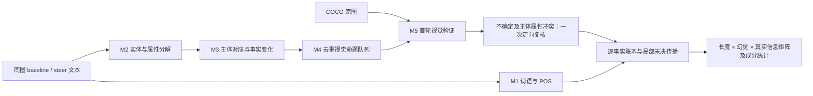

# Steer 输出缩短的实体／属性分析框架

分析同一图片的 baseline 与 steer 文本：把长度变化拆成真实信息、幻觉、实体、属性、重复提及和词性成分的变化，为后续 steering 模块设计寻找可检验的动机。

**当前版本：`visual_graph_v5/entity_graph_attribute_frozen` 保守候选版。** 新入口支持图片＋两段文本的端到端分析；旧 `final_v1` 与 revision v2 均保留。400 对实验的矩阵可分类率从原冻结版 46.75% 提高到 80.50%（322/400）。完整联合方案可达 323/400，但旧参考上的属性一致率下降，因此最终固定为“实体使用联合区域验证、属性保留原方法”的类型路由。覆盖率不能视为准确率，本版本尚无独立人工 gold。



## 文档入口

- [框架模块、数据流和字段用途](docs/FRAMEWORK.md)
- [实验设置、指标、结果与复现](docs/EXPERIMENTS.md)
- [开发历史与修复报告索引](docs/DEVELOPMENT_HISTORY.md)
- [最新 400 对完整汇总报告](results/coco400_revision_v2_guard/RESULTS.md)
- [保守 v5 改进、测试与剩余问题](docs/history/reports/visual_graph_v5/RESULTS.md)
- [当前矩阵、成分和 POS 可视化分析](results/visual_graph_v5/analysis/REPORT.md)
- [框架持续改进日志索引](docs/framework_iteration_log_index.md)
- [发布范围与复现边界](docs/PUBLICATION.md)
- [原始动机优先指标规划](docs/motivation_first_observation_plan.md)

## 安装与运行

在仓库根目录运行，建议 Python 3.12：

```bash
python -m venv .venv
# Windows: .venv\Scripts\activate
# Linux/macOS: source .venv/bin/activate
python -m pip install -r requirements.txt
python -m spacy download en_core_web_md
```

准备 COCO 2014 validation 原图。历史示例／测试使用的 28 个图像文件（约 4.6 MB）已随包保留原字节和哈希；其中部分历史版本与官方归档同 ID 图片编码不同，不能直接替换。有本地数据时，以下命令复制本轮 400 张实验图并验证随包示例哈希：

```bash
python scripts/prepare_data.py --coco-root /path/to/coco2014/val2014
```

没有数据时可先执行 `python -m experiments.coco400_v1.download` 下载官方 val2014 原图及 trainval2014 标注压缩包，再运行 `python scripts/prepare_data.py`。下载需要约 6.9 GB，解压和分块下载另需磁盘空间。

将 `decomposition/api_config.example.json` 复制为 `decomposition/api_config.local.json`，在本地填写 API key，model 填 `deepseek-flash`，保留官方 `https://api.deepseek.com` 和 `thinking: disabled`。该配置不入 Git。实际阶段还会显式固定模型名。

```bash
# 1 对输入冒烟运行；将文本、图片和 few-shot 示例发送给配置的官方模型服务
python -m experiments.coco400_revision_v2.end_to_end --pairs inputs/sample_pair.jsonl --output outputs/sample_run
# 完整 400 对：会产生模型调用和费用
python -m experiments.coco400_revision_v2.end_to_end --pairs inputs/coco400_pairs.jsonl --output outputs/new400
# 同一输入、代码、示例、配置的中断恢复
python -m experiments.coco400_revision_v2.end_to_end --pairs inputs/coco400_pairs.jsonl --output outputs/new400 --resume
```

使用仓库附带默认 profile。自定义 profile 的二轮复核配置尚未完全独立于默认路由，不作为本发布版的受支持运行方式。

## 离线检查

```bash
python scripts/check_results.py
python -m unittest experiments.coco400_revision_v2.test_revision experiments.coco400_revision_v2.test_local experiments.coco400_revision_v2.test_e2e.NewEntryTests -q
```

前者从已发布逐对观测重算矩阵，不需要模型或图片。后者使用随包测试图片，需安装 spaCy 模型，无需 API key 或完整 COCO 下载；包含屏蔽网络的端到端／断点恢复测试，不衡量视觉模型准确率。实际验证依赖版本记录在 `requirements-tested.txt`。

## 当前主要观察

| 项目 | 原冻结 400 对 | Revision v2 | 保守 v5 |
|---|---:|---:|---:|
| 可分类矩阵样本 | 187 | 269 | 322 |
| 矩阵未决样本 | 213 | 131 | 78 |
| 相对上一列净恢复 | — | 82 | 53 |

395 对文本变短，总词数 35,191→16,951，减少 51.83%。其中“幻觉不变、支持信息有增有减”为 81 对，72 对确认当前实体／属性命题前后均无幻觉。主体前后均受支持且身份对齐的 314 条原支持属性中，154 条删除、11 条改写；大小和材质的保留率明显低于颜色。这些是语义重组和属性保护的候选证据，不能据此断言 steer 的神经因果机制。标签来自自动分析与开发参考，尚无独立人工 gold。

v5 的 78 对未决中，42 对涉及视觉未决、30 对涉及语义未决、27 对涉及技术依赖、11 对涉及 M2 成分缺失；问题可重叠。64/78 对已有一个整体方向可判断，71/78 对至少有一个实体或属性成分可分析，未被强行塞入完整矩阵。

本仓库覆盖原仓库文件内容，旧 VISTA 代码仍可从 Git 历史提交 `4b41ff0` 获取；[旧仓库说明](docs/history/previous_repository/README.md)保留作背景。
