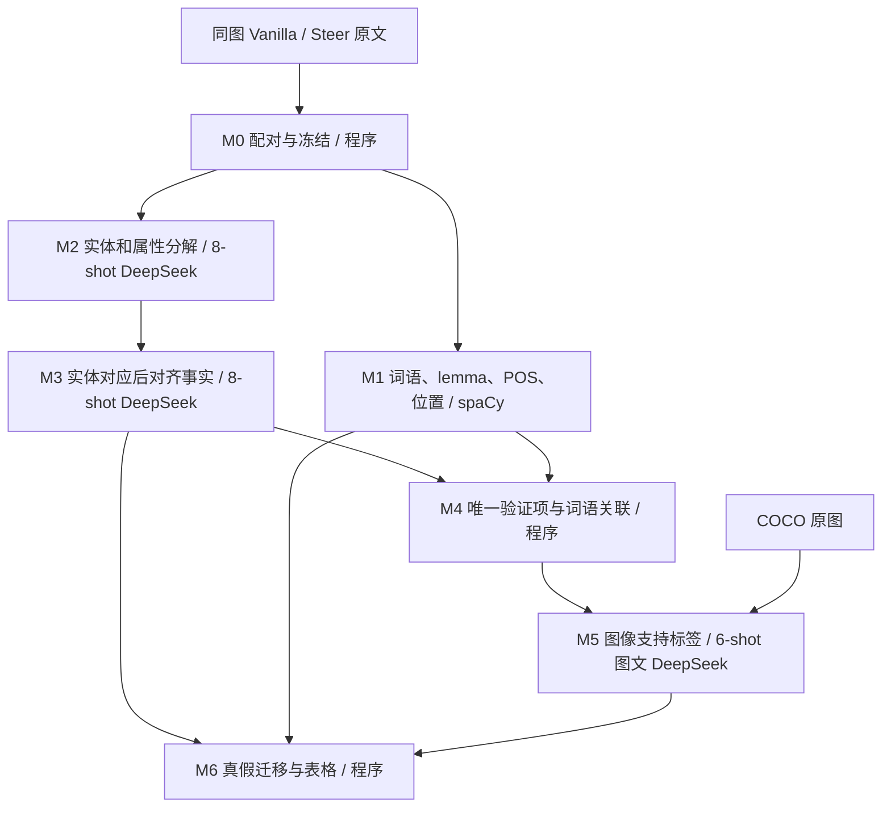

# 文本双粒度分析骨架 v1

当前工程入口见 [framework_v2](framework_v2/README.md)，计划首轮的工程/分母改进及84项测试见 [首轮交付报告](../outputs/framework_v2_stage1_release/RESULTS.md)。模型语义优化与独立参考验收仍按阶段推进。

最新修复入口见 [repair_v1 说明](repair_v1/README.md)，本轮结果见 [修复与复测报告](../outputs/skeleton_repair_v1/RESULTS.md)。修复版保留原模块为基线，新增局部提及隔离、对齐格式规范化和视觉定位语境；以下原 v1 建设记录保留作历史说明，其“尚未运行”状态不代表最新进度。

已实现 M0–M6 基础模块、逐模块测评入口和串联入口。2026-09-12 完成 18 次已授权的 DeepSeek 在线调用，以及 34 项本地检查。**当前是可检查的开发基线，不是通过正式语义验收的科研测量工具。**

主要结果见 [本轮模块报告](../outputs/skeleton_v1/MODULE_REPORT.md)，完整设计见 [模块构建规划](../refine-logs/MODULE_BUILD_PLAN.md)，类别及分母见 [protocol.md](protocol.md)。

## 架构和数据流



| 模块 / 文件 | 关键记录 | 后续用途 | 生成式 LLM |
|---|---|---|---|
| M0 / `m0_data.py` | pair_id、caption 原文、图像路径/hash、异常名册 | 连接各模块；缺图、缺侧保留 | 无 |
| M1 / `m1_lexical.py` | text、lemma、upos、字符偏移、句号编号、词位置、词频、caption 长度 | M4 关联 fact→token；M6 分析词性、位置和长度 | 无，固定 spaCy 模型 |
| M2 / `m2_decompose.py` | 实体锚点及全部已抽取提及、属性槽/值、证据/value span、排除项、局部问题 | M3 对应主体及事实；M4 模板命题；证据回接 M1 | 每 caption 一次，8-shot |
| M3 / `m3_align.py` | entity 对应表、事实边、五种迁移状态、extraction_gap、删除原因 | M4 仅复用已确认 retained；M6 分真假迁移 | 每 pair 一次，8-shot |
| M4 / `m4_queue.py` | claim_id、原/新 fact_refs、原子命题、主体语境、token/POS/位置链接 | M5 验证；M6 单次回填与分层 | 无 |
| M5 / `m5_verify.py` | supported / hallucinated / uncertain、短理由、模型标识、耗时、失败 | M6 组合 M3 状态；不改写 M2/M3 | 每唯一 claim 一次，6 个真实图文示例 |
| M6 / `m6_analysis.py` | transitions、pair_metrics、POS 切片、修改前后真假、未决/缺失和分母 | 审核删除原因、密度变化、实体保留条件下的属性变化 | 无 |

词语层不只是备份。原词和偏移来自 spaCy 分词及程序索引，lemma/POS/句界来自固定 NLP 模型，重复词面由 Counter 计算；M4 用字符区间把细粒度事实连回词语。属性只取 value span，避免将每个属性都算进主体名词。词频不等于同一实体重复，后者依赖 M2 的实体锚点与提及。POS 不输入 M2/M3/M5，也不决定事实属于实体还是属性。

## 当前文件与运行方式

从项目根目录使用已有 `.venv\Scripts\python.exe`。复用旧 `SpacyParser`、重复检测、原子文件写入和官方 DeepSeek 请求实现；旧实验代码和结果未覆盖。

| 内容 | 路径 |
|---|---|
| 固定模型规则 | `prompts/decompose.txt`、`align.txt`、`verify.txt` |
| 完整 few-shot | `shots/decompose.jsonl`（8）、`align.jsonl`（8）、`verify.jsonl`（6） |
| 固定开发测评 | `fixtures/decompose_pilot.jsonl`、`align_cases.jsonl`、`verify_cases.jsonl` |
| 可读示例、原图和答案 | [EXAMPLE_REVIEW.md](../outputs/skeleton_v1/audit/EXAMPLE_REVIEW.md) |
| 单变量后续实验卡 | [EXPERIMENT_CARD.md](EXPERIMENT_CARD.md) |
| 数据划分状态 | [splits.json](splits.json) |

本地回归和明确标注的合成计数演示（不调用 API）：

```powershell
.venv\Scripts\python.exe -m analysis_skeleton.evaluate_local --output outputs/skeleton_local_new
.venv\Scripts\python.exe -m unittest tests.test_skeleton_pipeline -v
```

各独立在线测评入口如下；本轮已运行，无需为查看结果重复调用：

```powershell
.venv\Scripts\python.exe -m analysis_skeleton.m2_decompose --cases analysis_skeleton/fixtures/decompose_pilot.jsonl --output outputs/skeleton_m2_new
.venv\Scripts\python.exe -m analysis_skeleton.m3_align --cases analysis_skeleton/fixtures/align_cases.jsonl --output outputs/skeleton_m3_new
.venv\Scripts\python.exe -m analysis_skeleton.m5_verify --cases analysis_skeleton/fixtures/verify_cases.jsonl --output outputs/skeleton_m5_new
```

串联入口为 `python -m analysis_skeleton.pipeline --pairs <M0的pairs.jsonl> --pair-id <明确选择的ID> --output <新目录>`，可重复传入 `--pair-id`。它读取 M0 的真实字段，按阶段落盘，通过 M4/M6 导出表格，不读取测评参考。当前只经过离线模拟调用的集成检查，尚未对真实 pair 运行整条链；不要把独立 M2/M3/M5 分数拼成端到端准确率。

M4/M6 也能独立消费 `bundles.jsonl`：每行包括 `pair_id, original, steer, alignment, image_path, image_sha256, lexical`。`original/steer` 是规范化分解文档；`lexical` 是两侧 M1 记录。M6 的 verification 输入为平铺的 `claim_id, label, status/reason`，串联入口自动生成这些文件。

```powershell
.venv\Scripts\python.exe -m analysis_skeleton.m4_queue --bundles <bundles.jsonl> --output <新目录>
.venv\Scripts\python.exe -m analysis_skeleton.m6_analysis --bundles <bundles.jsonl> --queue <verification_queue.jsonl> --verifications <verification.jsonl> --output <新目录>
```

输出目录必须为空。每轮记录输入、代码、prompt、shot 哈希并复制代码；请求前检查冻结内容，单请求保存原始响应。每次生成一次、零自动重试、无修复模型、无多模型投票。示例生成脚本 `build_*_fixtures.py` 是作者工具，正常运行不执行，不在实验途中重建示例。

文本使用现有 `decomposition/api_config.local.json` 的 `deepseek-v4-pro`；视觉显式使用支持图像的 `deepseek-flash`，都连接官方 `https://api.deepseek.com`。密钥只从已有本地配置读取，未复制到产物。M5 的图像能力依据 [DeepSeek 官方视觉指南](https://api-docs.deepseek.com/guides/vision/)，实际返回模型标识也已保存。

## 已实现与尚待验收

已实现：双粒度记录、实体/属性分解、对齐、真实图文 few-shot 验证、共享回填、基本真假迁移和 CSV 导出、完整异常名册。

待完成的科研验收：人工审核示例/参考；真实长文本及多主体的独立测试；各模块独立重复 3 次；人工 POS/lemma、范围分流、实体绑定、误合并测评；真实端到端联合指标。当前 M6 只完成基础计数与表格，图像级 bootstrap、三类研究图表和 steering 干预实验尚未执行/交付。这些应在测量协议校准后推进，不能用本轮开发集高分替代。
# 视觉改进候选实验（第二轮）

新增独立的原像素局部视图与few-shot主体字段适配器，均未达到实体90%验收线，未替换本框架默认视觉路径。202次实际调用、92项离线测试及回退结论见[第二轮报告](../outputs/visual_improvement_round2/RESULTS.md)。
