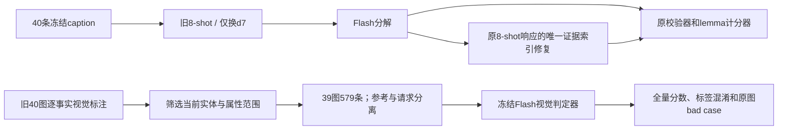

# 本轮模块迭代与旧视觉标注复用

本轮分别评测M2和M5，不重新生成align结果，不把两个独立模块分数当端到端准确率。原参考、原生产提示及原八个示例保持不变。

M2：40条原caption，两组均显式Flash、8-shot、温度0、thinking disabled。只替换d7，加入one/other两只不同颜色的狗，检验实例区分。结果未通过门槛，不启用该示例。独立的value_anchor候选仅在原属性证据内有唯一相同词面时修复错误occurrence；保存响应离线重算，不新增调用、不改语义、不改标签。

M5：复用旧635条候选中的579条（508实体、71属性）。42条超出当前属性槽，14条属于与原few-shot重合的图片。筛选清单在预测前冻结，完整原始标签保留，未根据模型结果改标签。实体命题中的数量/颜色/位置限定仍可能来自旧schema，因此主指标是旧完整命题的一致率，不等于纯物体识别准确率。

调用入口：`python -m analysis_skeleton.decompose_iteration_v1.experiment prepare|run|report --output <new-directory>`；视觉为同包`legacy_visual`。只有run接受`--resume`，断点恢复不重复请求。batch限定4个并行请求，逐条保存带校验的原始响应；每个样本最多一次新请求，无自动重试。

结果分别位于`outputs/decompose_iteration_v1_flash`及`outputs/legacy_visual_full_flash_v1`。视觉批次获用户单独授权后运行；请求不含参考标签、参考理由、模型历史答案或对齐答案。原标签来自旧Codex看图记录，未升级为人工gold。
