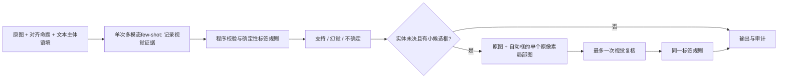

# 证据驱动M5实验实现

保留decompose→align→visual verify的分析结构。本模块只替换视觉判断接口，未修改主框架默认M5，也未改测试参考。



主要代码：

- `stage.py`：同一6张示例图片和原命题，用结构化证据演示原来S/H/U含义；新的system prompt匹配该输出合同。每条仍调用同一模型一次。记录candidate_status、region_status、bbox、observed_category、scope、visible_cues、limitation、attribute_status。
- `compiler.py`：根据视觉状态生成旧接口可使用的label、reason，并保留证据及decision_rule。属性主体未确认时不能仅凭attribute_status=supported判S。主体不存在或为不同类别时，属性not_applicable合法；这是一项独立程序修复。
- `roi.py`：只选择模型自己报告为未决、有小候选框、且限制为视觉问题的实体；程序按统一规则加25%边距裁取原像素，保留原图，最多一次局部复核。选择不读参考标签。实验同时设置一条原图重复对照。
- `experiment.py`：原版与证据版固定60条成对测评，各60次。输出结构改变需要同步调整说明和示例输出，因此这是模块接口干预，不能单独归因于某一个字段。
- `summarize.py`：保留原始v1分数，独立复算compiler修复分数、原图重复策略和局部复核策略；不择优挑标签。

证据和bbox均为模型预测。bbox只通过数值/几何校验，`bbox_verified=False`；不能据此宣称正确定位或直接用作新的人工参考。局部复核返回的框不再触发二次裁图。

结构一致性不等于视觉正确性：同一证据记录内的主体/属性约束由程序保证，不保证多个独立调用对同一主体意见一致。跨命题的parent-U/attribute-S仍须由framework_v2分母账本审计。

## 复现

```powershell
.venv\Scripts\python.exe -m unittest tests.test_evidence_verifier_v1 tests.test_evidence_compiler_v2 tests.test_evidence_roi -v
.venv\Scripts\python.exe -m analysis_skeleton.evidence_verifier_v1.experiment prepare --output outputs/evidence_verifier_v1
.venv\Scripts\python.exe -m analysis_skeleton.evidence_verifier_v1.experiment run --output outputs/evidence_verifier_v1
.venv\Scripts\python.exe -m analysis_skeleton.evidence_verifier_v1.experiment report --output outputs/evidence_verifier_v1
.venv\Scripts\python.exe -m analysis_skeleton.evidence_verifier_v1.roi prepare --output outputs/evidence_verifier_v1
.venv\Scripts\python.exe -m analysis_skeleton.evidence_verifier_v1.roi run --output outputs/evidence_verifier_v1
.venv\Scripts\python.exe -m analysis_skeleton.evidence_verifier_v1.summarize --output outputs/evidence_verifier_v1
```

已有目录不可重跑覆盖；prepare/run使用全新目录。主实验run支持`--resume`；ROI跟进保存独立检查点，CLI尚未提供恢复开关，不能对同目录直接重跑。各条件独立冻结，后续compiler修复不改原始MCP/API响应或旧分数。

[本轮结果与错误定位](../../outputs/evidence_verifier_v1/RESULTS.md)：整体47/60→51/60，实体33/41→34/41，仍未通过实体90%及错误确定判断不增加的门槛。
