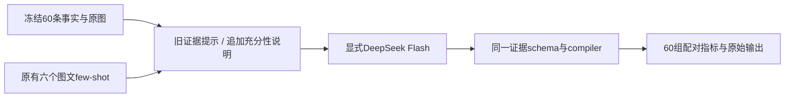

# Flash 证据充分性迭代

本轮沿用 v1 结构化证据及修正后的 compiler，仅给系统提示追加“针对当前命题判断证据是否充分”的说明。六个图文示例的输入与输出、原图、文本上下文、标签编译规则均不变。两组都显式请求 `deepseek-flash`，温度0、thinking disabled，每条命题一次调用，不叠加ROI。



新说明解决两个相连的边界：模糊是否真正妨碍当前类别识别；未认出目标是否足以证明其缺席。颜色不能单独证明类别，前景清晰也不能证明背景可检查。说明直接引用原有v1—v6示例的边界，没有加入本批测试答案。

通用本地配置原为 `deepseek-v4-pro`，已按用户要求改成 `deepseek-flash`，凭据不变。但上轮M5的请求与响应已是Flash，因此本轮不能声称是Pro与Flash的模型对照。M2/M3将读取新的通用默认，本轮没有重新评测其模型变化。

运行：

```powershell
.venv\Scripts\python.exe -m analysis_skeleton.evidence_verifier_v2.experiment prepare --output outputs/evidence_verifier_v2_flash_network
.venv\Scripts\python.exe -m analysis_skeleton.evidence_verifier_v2.experiment run --output outputs/evidence_verifier_v2_flash_network
.venv\Scripts\python.exe -m analysis_skeleton.evidence_verifier_v2.experiment report --output outputs/evidence_verifier_v2_flash_network
```

完整运行后可用相同run命令加 `--resume`；已有检查点不会再次请求。新的实验必须使用新目录。受限环境首条URLError保留在 `outputs/evidence_verifier_v2_flash`，正式联网测试在后缀 `_network` 的独立目录；两者不混合计分。

指标仍是对旧助手候选参考的一致率。验收要求实体至少37/41、确定性实体错误不增加、属性不下降、技术失败为零。样本已参与开发，不是独立测试集，达到门槛也不等于已证明泛化准确率。
