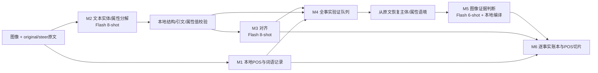

# Final v1 固定入口

从项目根目录使用 `.venv/Scripts/python.exe`。模型在代码中固定为 `deepseek-flash`，M2/M3/M5分别使用8/8/6-shot；API密钥仍由本地配置读取，不写入版本清单或报告。

最终选用条件、完整分母的测评结果及未达标项见 `outputs/final_v1_release/RESULTS.md`；入口必须显式传入该目录的 `profile.json`，不会因为存在候选文件就自动切换模型或合同。

冻结配置为M2 `owner` + 两个本地校验，M5 `typed`（entity使用context证据合同，attribute使用完整proposition合同）。这是本轮测试后的固定类型组合，模型不读取参考答案决定路由；组合的579条分数来自已测条件的对应类型响应，不冒充另一轮独立调用。全部M5实体条件均未超过90%，本版不具备无需复核的语义研究验收资格。



| 模块 | 本轮调整与数据用途 | LLM参与 |
|---|---|---|
| M1 | 复用词面、lemma、UPOS、原文偏移与重复提及记录；原文跨度连接到实体/属性。未连到事实的词也保留在POS统计中。 | 无，spaCy |
| M2 | 明确实例与衣物/部分属性属主；只替换第7个示例并加入一段覆盖规则。保留实体ID、名称、mentions，属性entity_id/slot/value、证据和值跨度，以及excluded/issues。它们参与对齐、验证定位、分母和词级统计。 | 每caption一次，8-shot |
| M2本地校验 | 保留原始响应；只有证据区间内唯一逐字值匹配时修复occurrence；六种state必须有明确词面支持，拒收记录进入审计。不能用这些规则推断属主或视觉真假。 | 无 |
| M3 | 复用框架原有对齐合同；实体映射、事实对应和未决原因进入M4/M6。新版本显式固定Flash。 | 每对caption一次，8-shot |
| M4/语境 | 所有已接收实体/属性进入队列，包括未对齐事实；逐条恢复真实原文位置。属性使用自己的证据位置，代词或多次指代保留完整caption。每个来源及定位失败状态可追溯。 | 无 |
| M5 | 同一图像、同一事实、一条调用；保存candidate/region/bbox/类别/限制/属性证据及原始响应，再由本地规则输出三分类。最终profile选择已测合同，候选分支保留用于复现。 | 每个去重命题一次，原6个图文示例，无额外裁剪/评委 |
| M6 | 复用逐事实账本，分开记录抽取、对齐、视觉状态；保留主体未确认、属性冲突与strict_parent_supported_eligible，供语义保留/消退分析。 | 无 |

运行示例（输出必须是新目录）：

```powershell
.venv/Scripts/python.exe -m analysis_skeleton.final_v1.pipeline --profile outputs/final_v1_release/profile.json --pairs analysis_skeleton/fixtures/expansion20/pairs.jsonl --pair-id 303499 --output outputs/my_final_v1_run
```

恢复同一任务时使用完全相同参数并加 `--resume`。代码、prompt、few-shot、profile、图片和输入均冻结；改变其中任一项应使用新的输出目录。

核心输出：`bundles.jsonl`含分解/对齐/POS；`verification_queue.jsonl`含全部验证输入及来源；`verification.jsonl`含原始视觉响应、证据、判定规则；`denominator_ledger.jsonl/csv`含逐事实状态与父实体约束；`isolated_records.jsonl`保留隔离记录；`lexical_slices.jsonl/csv`提供词语统计。语义分析优先读取`strict_analysis.json`：属性的支持事实分母要求父实体也受支持，零分母为null，并列出所有排除ID。`m6/`继续保留历史统计口径，不能代替严格分母结果。`metrics.json`为运行完整性而非端到端语义准确率。

本入口仅支持新调用及同运行检查点恢复，拒绝跨运行`reuse/replay`或传入cache文件，以封闭旧共享缓存未包含claim_type的问题。原始响应检查点在请求后即时落盘；不要在批量结果表持续重写时并发读取该表，Windows可能阻止原子替换。若导出中断，使用同任务`--resume`从已保存检查点恢复，不能删除started检查点后盲目重发。

M5的bbox只是模型预测，没有独立定位真值。保留事实共享一次视觉查询的既有逻辑时，相同视觉指代仍依赖M3；各来源context及共享标志均落盘。抽取遗漏不会凭空进入生产账本，测评需另用参考账本计算漏抽分母。现有研究标签是历史候选标注，不能把开发集一致率写成人工金标准确率。
