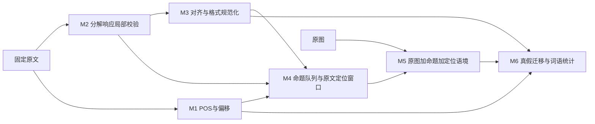

# 修复版本 v1

本目录是可运行的修复入口，原 analysis_skeleton 顶层代码和 expansion20 结果保留为基线。复用原 transport、few-shot、计分函数、POS 和 M6，不增加修复 LLM。

## 修复与数据去向

| 模块 | 改动及保留字段 | 下游用途 | 新增 LLM |
|---|---|---|---|
| M2 contracts | 一个实体有有效提及时，只隔离无效提及；有效 mentions、实体和属性继续保留。错误原样进入 source_audit | 有效事实进入 M3；有效偏移进入词语链接和视觉定位。source_audit 仅审计，不输入模型 | 0 |
| M3 alignment | 拆开明确单侧的批量新增/删除；相交的纯 unresolved 集合合并。format_audit 保存原行与变换 | 仍未解决的主体保持 unresolved；禁止据此强行新增/删除属性。规范结果进入 M4/M6 | 0 |
| M4 context | 从原文确定性截取主体所在句及前一句，记录 source_window、窗口内 target_mention 偏移、context_role | 作为 M5 定位线索，不成为额外关系事实、不作为视觉真值证据；原 token_links 仍进入 POS 统计 | 0 |
| M5 verify | 同一原图、命题、模型和 6-shot，补充 query 的 entity_context | 仍输出 supported / hallucinated / uncertain；按 claim 回填事实 | 每个未命中缓存的命题 1 次，与原框架相同 |
| M6 | 复用原统计 | 保留分母、技术未决、视觉 uncertain、属性与主体真值冲突、POS 切片 | 0 |



## 固定实验顺序

1. replay_evaluation：同一保存响应比较 M2 引文处理、M3 格式处理，两项独立；不重新生成。M2 两边固定实体词形计分器，不能把之前计分口径变化算作模型提升。
2. visual_ab：固定 60 个原候选参考，双条件各生成一次，30 个先 control、30 个先 context，seed=1994。仅改变定位语境；原系统规则、6-shot、标签边界不变。报告各类 P/R/F1、Macro-F1、候选一致率、改善和退化案例。
3. pipeline：固定 20 图的集成复测。M2 复用修复文档；M3 完整模型输入与身份一致才复用，否则请求；M5 图像哈希、命题、完整语境及身份一致才复用预测。M6 导出词数、事实数、消退分母和 POS 表。集成差异不可归因于单个修复。

运行目录均从项目根目录解析；输出目录不得已有内容。本轮已生成结果，不要为了查看而重复付费调用。

```powershell
.venv\Scripts\python.exe -m unittest tests.test_skeleton_repairs tests.test_skeleton_repair_integration tests.test_skeleton_pipeline -v
.venv\Scripts\python.exe -m analysis_skeleton.repair_v1.replay_evaluation
.venv\Scripts\python.exe -m analysis_skeleton.repair_v1.visual_ab --prepare
.venv\Scripts\python.exe -m analysis_skeleton.repair_v1.visual_ab
.venv\Scripts\python.exe -m analysis_skeleton.repair_v1.pipeline
```

## 不随复测改变的协议

实体、属性槽及六种 state 边界，8/8/6-shot、原候选参考和图片均保留。本轮不增加关系类别、不给 uncertain 强行改标签、不用额外模型修复输出。仅原文定位语境是一项视觉输入干预，不能假定它一定提高准确率。

候选参考由助手预先整理，尚未成为独立人工 gold。开发集修复与模型生成各一次的结果，不能代替独立测试集或稳定性测评。
