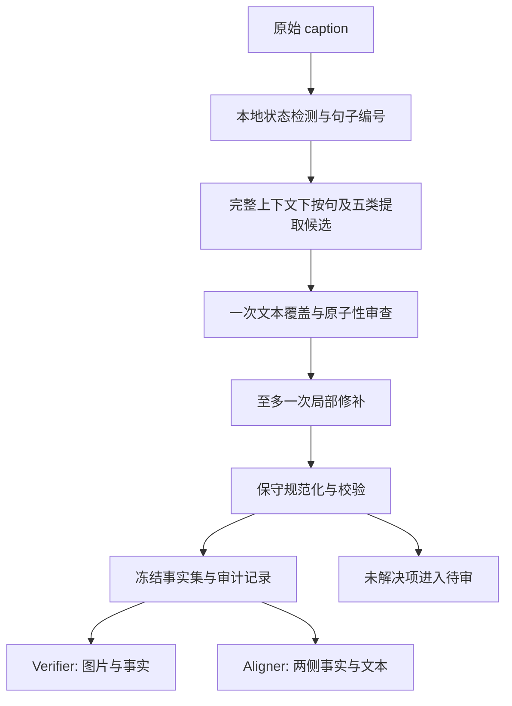

> v3 实施更新：根据用户后续截图，当前采用一次提取＋本地 Object 覆盖，不再采用本提案中的第二次 LLM 审查。详见 README.md。

> 实施更新：decomposer 部分已按 FaithScore 参考方案实现，当前用法见 README.md，来源差异见 FAITHSCORE_REFERENCE.md。以下保留原提案；Verifier/Aligner 与大规模未见金标不在本次实现范围。

# 面向 Steering 语义损失实验的稳定拆分方案

日期：2026-09-09。状态：实现提案，尚未实施或进行新 API 实验。

依据：[总体实验目的](../vlm_steering_experiment_overview.md)、[当前协议](STABILITY_PROTOCOL.md)、[当前测试报告](../outputs/minimal_v1_refined_run1/TEST_REPORT.md)。本方案针对 Semantic Decomposer，并定义其与 Analyzer、Verifier、Aligner 的接口边界。

## 1. 要稳定测量的量

研究关心的是同一图像、同一生成设置下，steering 改变了哪些事实，以及这些事实的真假。拆分模块的目标应是：同样的含义产生同样粒度的可比较事实，颜色、动作、关系、数量等真实差异不被抹平。

因此需要同时满足：

- 语义覆盖：不能系统性少拆长 caption、后半句或某一类别。
- 原子性：一条事实承载一个可单独改变、可单独验证的命题。
- 类型一致性：同一含义不能一轮归 attribute、一轮归 relation。
- 对齐可用性：同义改写不能被误认为 removed + added。
- 可复现性：发布后的事实集和版本可完整复核。

现有结果为 12 条真实 caption 中 11 条可拆分、1 条退化；两轮 6/11 字面完全一致、micro Jaccard 77.95%。这些是已有小样本诊断，不是新方案的效果证明。两轮共同遗漏也已出现，因此单看一致性不足以验收。

## 2. 推荐架构



常规非空 caption 预算为一次提取、一次审查；仅有具体未解决问题时允许一次局部修补。不开展无限反复生成，也不取两次结果的交集。交集会稳定地删掉只出现一次的正确事实，尤其不适合测量信息损失。

所有模型调用继续强制关闭 DeepSeek 思考，temperature=0。这些设置降低可控的采样变化，但不能保证语义输出完全确定。

## 3. 先冻结原子化协议

### 3.1 一个可以独立变化的命题一条事实

必须调整目前把 `player wears white uniform` 合成一条 attribute 的规则。对比：

```text
Vanilla: A player wears a white uniform.
Steered: A player wears a uniform.
```

推荐拆法：

| type | Vanilla 事实 | Steered 中的变化 |
|---|---|---|
| object | player exists | retained |
| object | uniform exists | retained |
| relation | player wears uniform | retained |
| attribute | uniform worn by player is white | removed |

这里只减少一个颜色属性，不应把穿着整个记作删除。自然语言中的 `worn by player` 仅用于明确指称；不创建实体 ID，也不额外重复计算一条关系。

同理，`small red car` 的 small、red 分别列为属性；`man sits on ground` 拆为 sitting 动作和 on-ground 关系。禁止既输出一个复合命题、又输出其全部组成命题，造成重复计数。

### 3.2 五类边界固定

| 类型 | 固定口径 | 例子 |
|---|---|---|
| object | 明确提到的具体对象类存在性；重复提及不重复计数 | car exists |
| attribute | 独立可变化的可见性质 | car is red；car is small |
| action | 动作、姿态或动作状态；停放按总体文档归此类 | car is parked；man is sitting |
| relation | 显式空间关系及穿着、手持等可见关联 | player wears uniform；player holds racquet |
| count | 原文的数量、数量单位、范围及上下界 | two piles of broccoli exist；at least two surfboards exist |

这会将 wearing 从当前 attribute 改为 relation，是明确的协议版本变化。须更新金标并重跑 vanilla 与 steered 两侧，旧、新结果不能直接拼接比较。这是为了让总体实验能测量独立信息的删除，不新增第六类或 subtype。

### 3.3 不以规范化牺牲信息

- 保留否定、阶段、模态、数量单位和下界。`prepares to serve` 不等于 `serves`；`two piles of broccoli` 不等于 `two broccoli`。
- `another` 只有在上下文明确引入另一同类对象时产生至少两个；不能把“another possible interpretation”当实体数量。
- 普通数词描述的局部集合、显式 `exactly` 和 `at least` 分开处理；不擅自把普通 two 升级为整张图片恰好两个。
- 复数、a/an、反复提及不自动生成 count。few/several 保留原粒度。
- `lemon slice` 的切片信息必须保留。第一版保留稳定的对象短语 `lemon slice exists`，不可无记录地改为 `lemon exists`。对齐时较宽泛的 lemon 只能证明较弱含义保留，不能声称切片信息也保留。若研究希望把形态损失固定统计为 attribute，需在协议冻结前统一选择 `lemon exists + lemon is sliced` 并对整个数据集执行；不能在运行时混用两种口径。
- 复合名词与泛类采用一个冻结的短表加明确规则，未覆盖项保留原词。不要全局删修饰词，也不要为提高一致率把 phone、smartphone、Palm Treo 任意折叠。

### 3.4 无实体 ID 仍须保留关系方向和指称

`a red car left of a blue car` 必须保留 `red car is left of blue car`，不能简化成 `car is left of car`。颜色在这里作为关系的指称条件，不再次增加属性计数。

对象存在性按类去重；属性和关系保留区分对象所需的原文限定短语。只处理上下文中指代唯一的局部代词，指称不确定时将具体事实待审，不猜测跨句身份。这是第一版的能力边界，不能通过类级归并掩盖身份敏感的关系差异。

### 3.5 不由拆分器预先过滤潜在幻觉

当前“遇到 appears/seems/may/likely 就整体排除”的规则过宽。总体研究需要先知道 caption 说了什么，再判断图片支持什么。

- `person may be eating`：保留带限定的视觉 action 命题，不升级为 `person is eating`，也不因此额外断言 `person exists`。
- `car appears red`：保留限定语的 attribute；是否可由图片确认交给 Verifier，必要时 unknown。
- 审计旁路记录 assertive / qualified；主结果预先定义为明确断言，qualified 单独报告并做包含它们的敏感性分析。不能把两者混成相同强度的命题。
- delicious、beautiful、抽象意图、常识归属、纯氛围等不属于本版五类主统计，记录排除范围与数量，不称作真实或幻觉。
- 图像全局天气/光照仍是当前五类研究范围之外；明确说明本实验衡量的是这五类信息，不是 caption 全部语义。

## 4. 提取与审查如何实现

### 4.1 完整上下文，按句组织输出

本地给原文句子编号；保留原文，不先摘要、截断或改写。一次请求提供整个 caption 和带编号句子，模型按“来源句 × 五类列表”填写候选，空类填写空列表。

句子编号只是覆盖检查单位，不独立切开上下文。`He`、`another surfboard` 等依赖前文时，模型仍能读全文，审计可记录多个来源句。多句计数事实不强行绑定到单个孤立句。

研究输出仍是 `fact_id/type/fact`。来源句和审查依据只放 `audit.jsonl`，不进入语义类型统计，不恢复 token anchor、POS 对齐或主谓宾图。

### 4.2 一次目标明确的覆盖审查

审查器只读原 caption、候选事实和冻结规则，看不到图像、method、decode、CHAIR 标签或另一侧 caption。它只回答：

- 哪个原文命题漏了？
- 哪条候选不是原文表达，或丢失限定语？
- 哪条把两个可独立变化的命题捆在一起？
- 哪条类型违反固定约定或与已有事实重复？

每条建议必须附原文短引和来源句，以及 missing / not_in_caption / lost_qualifier / non_atomic / wrong_type / duplicate 中的原因。短引的字符串存在只能验证出处，不能证明语义正确；正文含义仍须审查。

本地数词、否定词、颜色/性质词等提示用于生成“待检查线索”，不能直接变成事实，也不把每个 ADJ 强制映射到一个 attribute。所有非空普通 caption 都做同样审查，避免只给某种 method 或长文本额外处理。

### 4.3 有限修补与可见的不确定性

只允许修改被定位的问题，其他候选保持不变。保存初稿、审查建议、修补结果和采纳/拒绝理由。一个问题最多做一次局部修补；不确定关系或无法确定覆盖完整性时进入待审。

事实未解决时可保留其他已审事实作浏览，但该 caption 的总事实数不能冒充完整结果进入主分析。对主分析使用合格配对，同时按 method/decode/长度报告待审比例，并对不完整样本做缺失敏感性检查；不能无声删除困难的 vanilla 长句。

审查模型也可能遗漏或改错。因此这一步是否有益，必须通过独立金标比较“提取后”与“审查后”的 precision/recall 验证，不将多调用一次当作稳定性的证据。

## 5. 规范化和复现分开处理

程序只做可审计的小范围规范化：空白、终止标点、局部 ID、排序、严格字面重复，以及经过回归测试的少数固定模板。同义变化、上下位词、主客体调换、数量强弱交给后续语义判定，不建立无限扩张的模糊去重系统。

只在存在性模板和明确规则允许时处理 person/people 等形态，不能全局把复数关系改为单数，破坏集合语义。

缓存键应包括原 caption 内容、协议版本、两份提示词 hash、模型请求配置和代码版本；发布时冻结通过审查的 artifact 并记录实际返回的模型标识。相同 caption 可复用结果，但各样本保留各自的 generation 数据和身份。

缓存保证已发布实验的复现；测模型重复性时必须旁路缓存，独立重复完整“提取—审查”流程。不能把缓存命中率报告成语义稳定性。

## 6. 保留后续 Verifier 与 Aligner 功能

Decomposer 不判断图片真假；Verifier 输出 supported/hallucinated/unknown。文本审查中的 not_in_caption 与图片不支持是两种不同错误。

Aligner 不以 fact 文本完全相等作为唯一条件。先用相同类型和保守文本规则找候选，再判断目标 caption 是否表达源事实的完整含义，显式检查否定、数量、属性限定及指称。

- 对每条 vanilla fact：被 steered 完整表达则 retained，否则 removed；不确定时暂不填写 change。
- 对每条 steered fact：其含义不被 vanilla 表达时才 added。
- 红变蓝仍是 red removed、blue added，不增加 modified。
- `exactly two` 改成 `at least two` 会丢失精确数量约束；反向则保留原下界并增加更强约束。采用定向蕴含，不能强制一对一或双向字面等价。
- 多条事实可以共同表达一个命题；不要因为一句改成两句就改变结果。
- 如目标原 caption 明明表达该事实、目标 Fact Table 却遗漏，登记 decomposition omission 并返修后再比较，不能悄悄用原 caption 补上事实表或直接标 removed。

在无实体 ID 的前提下，指称仍不唯一的匹配须待审，不做宽松的任意同类对象匹配。

## 7. 两张核心表与状态

Caption Table 保留总体文档字段，建议增加 generation_status 和 semantic_status，区分下面情况：

| 输入/处理情况 | generation_status | semantic 处理 |
|---|---|---|
| 正常且完成审查 | normal | ready，事实可进入统计 |
| 真实空输出 | empty | 合法空集合；可分析为空导致的事实删除 |
| Palm 整段重复 | degenerate_repetition | N/A，进入生成退化分析，不能等同全部语义被删除 |
| 有内容但全部属于范围外 | normal | no_in_scope_facts；保留排除依据和范围统计 |
| API/解析失败 | 保留原生成状态 | failed，N/A，不等于空输出 |
| 仍有遗漏/歧义 | 保留原生成状态 | needs_review；不当作完整事实集 |

token_len/eos_step 缺失仍为 null，不能用 spaCy 数量替代；POS 保持 caption 层统计。

基础 Fact Table 可继续六列存储，通过 sample_id 关联元数据；提供与总体文档一致的分析导出：

```text
sample_id,image_id,method,decode,fact_id,type,fact,truth,change
```

truth/change 未完成时留空，unknown 是已经执行图片验证后得到的标签，不能替代所有未处理情况。

同一 vanilla 可能对应多种 steering 强度或方法，change 是比较相关的。建议每个 comparison_id 单独导出 Fact Table，并在 manifest 记录两侧样本与相同图像/任务/解码/seed 等匹配条件；不能在一张无比较上下文的 baseline 行上覆盖 change。两张核心表之外仅保留审计和比较导出，不新增知识图谱。

## 8. 用实验指标验收，而不是只测 JSON

### 金标与测试划分

现有 12 条真实 caption 和固定例句继续作为开发回归集。新增人工标注应按 image_id 划分开发/未见评估集，同一图像的各种 method/decode 必须放在同一侧，避免配对泄漏。

建议先准备约 100 个独立图像的配对评估池，覆盖三种 decode、长短文本、末句、五类事实和退化情况；稀有 count 等类别需补足，必要时扩大评估池。至少一部分由两人独立标注并裁决。此处是后续工作量建议，本次没有采样或发送新增数据。

所有评估同时给出样本数、按图像重采样的置信区间，以及不同 method/decode/长度区间结果；小样本通过不代表广泛可靠。

### 必测内容

1. 人工金标 fact precision/recall，整体及五类分别报告。
2. 类型准确率、原子性错误率、否定/数量单位/下界/动作阶段的保留。
3. 对评估子集独立运行完整流程至少三次，按人工确认的语义等价比较事实集；字面一致率只作为诊断指标。不能用待测 Aligner 作为唯一裁判。
4. 人工配对金标上的 retained/removed/added 错误，尤其“文本实际保留却被系统标 removed”的比例。
5. 初提取与审查后的覆盖/误提取变化；缓存旁路与缓存复现分别检查。
6. 待审、失败、unknown、qualified、范围外比例及配对可用率；按条件分层，不能通过弃样提升准确率。

必须包含以下最小对照：

```text
wears white uniform -> wears uniform        只应丢颜色
small red car -> red car                   只应丢大小
is sitting on ground -> is on ground       只应丢坐姿
two piles of broccoli -> broccoli          丢数量单位与数目
is not under table -> is under table       不能等价
prepares to serve -> serves                不能等价
red car left of blue car -> reversed       不能等价
same facts in different word order         不应产生删除
repeated mention removed                   不应产生事实删除
Palm repeated / genuinely empty            两种状态不可混同
```

### 初始验收目标（待金标确认，非已达到）

建议以整体 precision ≥98%、recall ≥95%，各类 recall ≥90%，重复运行语义 F1 ≥98%，明确保留事实的伪删除率 ≤2% 作为启动目标，并同时约束待审率和分组差异。点估计必须带置信区间；低频类别不足时不得宣布通过。

最终更重要的是测量误差是否小于拟报告的 steering 效应。例如拟报告 3 个百分点的属性额外删除，工具的分组误差也接近 3 个百分点时，上述总体门槛通过仍不能支持该结论。还需排除长度/句子位置等解释，第一阶段观察不能直接证明独立于长度的因果选择性。

## 9. 落地顺序

| 顺序 | 改动 | 验证产物 |
|---|---|---|
| 1 | 冻结原子性、类型、范围和数量口径；更新版本 | 协议与最小配对金标 |
| 2 | 保留现有 API 配置、超时重试和存储；替换提取提示词并新增 coverage_auditor | 初稿/审查/修补三段审计 |
| 3 | 改进 generation/semantic 状态；增加来源句审计和保守规范化 | 空/退化/失败不混淆的两表导出 |
| 4 | 同批样本回归，逐条核对；评估提取前后增益 | 覆盖率、错误和重复性报告 |
| 5 | 用未见配对金标测下游伪删除；冻结发布版本 | 可复现 artifact 与误差边界 |

建议新增少量职责明确的代码：`protocol`（固定口径）、`coverage_auditor`（文本审查）、`normalizer`（保守格式规则）；复用现有 caption_parser、semantic_decomposer 的传输层、storage 和 CLI。暂不增加实体图、fact POS、多模型投票、复杂语义去重或图像验证逻辑到拆分器内部。

本次交付只提出上述方案，没有修改正在使用的拆分实现，也没有运行或新增任何 DeepSeek 请求。
