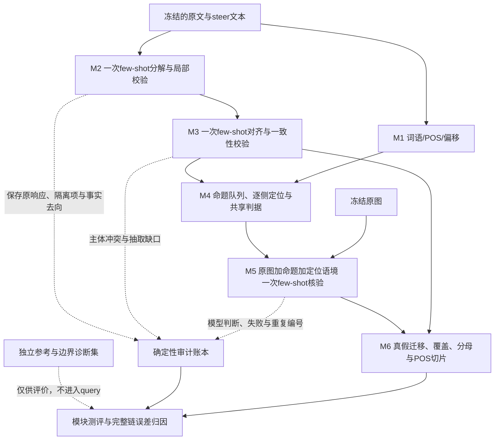

# 当前框架稳定性与准确率改进计划：供高推理 Astra 执行

日期：2026-09-12。依据：当前 analysis_skeleton、repair_v1、原20图扩大测评、修复复测及三篇相关论文。本文是改进计划；本轮只做只读审计与文档编写，没有修改运行代码、标签、few-shot，也没有新增模型调用。未使用自动科研 skill。

## 1. 总体判断与范围

保留现有主线：文本 entity/attribute 分解 → 文本对齐 → 逐命题视觉标记 → 真假迁移统计，并保留 POS/词语记录作为解释切片。当前需要改进的是这条测量链的可靠性，不扩回动作、关系、数量图谱，不增加常驻二次审查 LLM，不在本轮设计新 steering 算法。

**优先顺序：工程故障隔离和计分 → 标签边界与独立参考 → 同期重复基线 → 一个模块的一个干预 → 完整事实账本验证 → 未参与调试的新图确认。**

这次修复证明了两个局部工程问题可以通过确定性程序解决，也给出了视觉语境有用的开发信号；它没有证明模型跨次稳定、所有语义类别准确、或最终消退率可信。后续优化必须同时回答：错误减少了吗？可判定覆盖率变化了吗？用于科研结论的分母和消退率稳定了吗？

### 已有证据及其限制

| 证据 | 目前可以判断什么 | 不能据此判断什么 |
|---|---|---|
| M2 同一响应、同一词形计分器，F1 80.2% → 80.9%；恢复3个实体 | 坏提及局部隔离有效 | 属性抽取已经解决；属性 F1 仍73.4%，TP29/预测39/候选40 |
| M2 原侧候选召回125/169=74.0%，steer侧103/131=78.6% | 两侧测量误差可能不对称，需要按长度、侧别检查 | 两侧漏抽会自动抵消 |
| M3 同一响应 F1 88.5% → 93.1%；技术未决30 → 3/300 | 格式规范化改善可用输出 | 对齐语义能力提升4.6个百分点；尤其参考集 modified=0 |
| M5 同期 Macro-F1 59.5% → 71.8%；候选一致44 → 47/60 | 语境方案有开发价值，6改善、3退化、1条错误类别互换 | 视觉识别稳定提升12.3个百分点 |
| M5 两条件 supported 召回均87.5%，hallucinated召回均57.1%；uncertain召回38.5% → 61.5% | 提升主要来自减少错误确定判断；可判定覆盖率80.0% → 73.3% | 仅凭Macro-F1证明判断能力全面增强 |
| 历史M5与本轮control，60/60模型输入及identity相同，10/60标签改变；一致率83.3% | temperature=0仍不能保证跨次结果一致 | 将差异全部归因于采样随机性或服务漂移；现有证据无法分离二者 |
| 端到端264事实、199视觉命题，0待处理；仍9技术未决 | 链路可完成，结构审计起效 | 零技术失败等于零语义错误 |
| 原文H实体分母10 → 6；H属性1 → 0；S属性删除8/15 → 7/15 | 科研观察量对测量版本敏感 | 当前幻觉清理比例已稳定，或零分母意味着没有此类问题 |

M5候选一致率差的图像级配对bootstrap 95%区间为−5.0至13.3个百分点，包含零；这不是Macro-F1差的区间，也不包含参考标签错误和跨调用变化。

主要依据：[修复报告](../outputs/skeleton_repair_v1/RESULTS.md)、[机器指标](../outputs/skeleton_repair_v1/metrics.json)、[视觉逐例对照](../outputs/skeleton_repair_v1/visual_case_review.csv)、[原采样说明](../outputs/skeleton_expansion20/RUN_CARD.md)。20图来自53张合格本地图片、原文长度四档各5张，属于开发诊断，不能代表全部500图。

## 2. 论文如何约束本次改进

| 论文依据 | 对当前框架的实际启示 | 本次采用的边界 |
|---|---|---|
| FaithScore §3、§4.1–4.3：先获得原子事实，再核验图像；人工评价会修订事实、补遗漏，并单独测核验器 | 分解质量、视觉核验质量和整条链必须分别测；参考事实也需要检查。论文Table 2的LLaVA-1.5核验总体准确率为85.07%，核验本身并非天然无误 | 借鉴原子事实与独立核验评价。本项目S/H/U是三分类扩展，不能与论文二值准确率直接比较，也不能把助手参考叫人工gold。[论文](https://aclanthology.org/2024.findings-emnlp.290.pdf) |
| VISTA研究生成过程与层间的token logit排名，并据此实施干预 | 当前输出账本可筛选真实属性消失等候选现象；如要解释生成机制，还需要原始生成记录 | 先让测量器可靠。POS、词数和事实消失不等于logit下降，也不能证明提前EOS。[论文](https://arxiv.org/html/2502.03628v2) |
| Does Playing it Safe Count as Faithfulness? 将幻觉指标与信息覆盖及能力表现并列 | 本项目需要同时看真假删除、绝对信息量、密度与覆盖；测量器本身也可能通过更多uncertain减少错误确定判断 | 借鉴联合评价的思路，不直接移植其跨方法结论到本地VISTA数据；该文为2026-09预印本。[论文](https://arxiv.org/html/2609.01888v1) |

以下阈值、程序方案与实验顺序是针对本项目提出的设计，不是上述论文已经证明的结论。

## 3. 架构不扩张，补充校验和审计旁路

| 模块 | 下一版本应保留/新增的数据 | 后续用途 | LLM参与 |
|---|---|---|---|
| M1 | 原词、lemma、POS、句界、偏移；内容/功能词、事实关联/未关联词数 | 位置与表达方式切片；未关联不等于冗余 | 0 |
| M2 | 原响应、有效实体/属性、全部可靠提及、隔离原行、scope排除、绑定与值证据疑点 | 有效事实进入M3；疑点进入审计，不能伪装成语义删除 | 每caption一次，继续few-shot |
| M3 | 主体对应、事实状态、opposite_evidence、格式变换、冲突类型 | M4共享决策；M6区分真实缺席、抽取缺口、技术缺失和身份不明 | 每pair一次；不默认增加修复调用 |
| M4 | 每侧的source_window/target_mention、locator_status、query_hash、共享理由 | 命题可追溯；检查共享是否抹平两侧差异；独立于POS计数 | 0 |
| M5 | 原始S/H/U、原始理由、可选冻结reason_code、图像/上下文哈希、返回模型、response_id、时间、replicate_id、cache_mode | 三类计分、波动归因、风险与覆盖、原始判断复查 | 每个唯一待验query一次；重复仅在评价时开启 |
| M6 | 固定事实账本、原始标签与派生eligibility分别保存、全部分母、缺失流向、条件与非条件统计 | 最终观察量和误差预算；绝不靠LLM总结替代计数 | 0 |

新增字段必须说明是原始输出、程序派生还是审核结果。先增加审计字段，不同时改变筛选规则、计分器和提示词。

## 4. 第一阶段：零LLM工程与测评基础修复

这是Astra首先实施的阶段，可以在人工审核尚未完成时独立推进。修复后立即用已有响应和故障注入测评，不启动大批在线请求。

### E0：统一可复用入口与故障隔离

当前 repair_v1/pipeline.py 是固定20图的修复实验入口，依赖旧bundles和A/B缓存，并非完整的通用新数据入口。新版本应抽出可传pairs、run配置、可选缓存与输出目录的函数，支持新caption真实M2路径。旧入口和冻结源码保留；不要直接改动导致旧manifest检查失效的文件。

具体代码定位：

- [alignment.py:25](../analysis_skeleton/repair_v1/alignment.py#L25)：reason:null触发startswith异常，已由本地审计复现。先校验字段类型，将坏行局部隔离，保留raw；不能用空字符串替换后当合法语义输出。
- [pipeline.call](../analysis_skeleton/pipeline.py#L14)、[llm.py](../analysis_skeleton/llm.py)：输入构造、图像读取、响应解析和校验都应有明确的错误边界。未知代码缺陷要保留可诊断堆栈并标failed，不能catch-all之后返回成功。
- [repair runner](../analysis_skeleton/repair_v1/pipeline.py#L30)：单图损坏、单claim失败不应终止无关图片。完成的claim可恢复，失败/未完成保留名册。
- [ExactCache](../analysis_skeleton/repair_v1/pipeline.py#L18)：显式cache_mode=replay/fresh；同key多响应不能静默覆盖，需选择明确的run/replicate。缓存来源与返回模型身份可审计。

恢复须检查完整run身份、输入哈希及输出校验；完成的请求不重发。started但无响应不能当已完成，也不能保证服务端没执行：记为outcome_unknown、保留重发风险，不承诺网络故障下绝对只计费一次。严禁无限重试；本轮默认仍零自动重试。

验收：null/非字符串reason、错JSON、截断、超时、未知/重复ID、缺图/坏图、中途停止与恢复测试全部通过；失败保持technical/pending，绝不变成U/H；未受影响事实继续流转。对合法已保存响应，canonical事实/状态/标签输出与repair_v1一致，允许时间戳等运行元数据变化。原18项测试必须保留，但通过18项不代表新增入口已测完整。

### E1：计分器固定与完整分母账本

M2主口径固定repair_v1的实体lemma计分，legacy口径仅作历史对照。先人工审阅36个未匹配预测、72个未匹配参考，区分命名、范围、漏抽和绑定错误；不要针对这批输出继续临时加同义词。添加计分器自身的等价/非等价对照：单复数可等价，dog/animal、两个人/一个人、主体互换不可仅凭词面重叠得分。

每个观察量输出：参考/审计事实总数 → 可匹配抽取数 → 对齐可决数 → 视觉可决数 → 最终分母。预测多报事实另列，生产运行没有人工参考时不能虚构“参考总数”。每个事实保留extraction、alignment、visual三轴状态，避免只按某一个过滤顺序归因。

验收：264个现有事实及全部隔离项均有去向；重复回填为0；missing、semantic unresolved、visual U分开；同响应离线重算结果一致。计分协议如需改变，输出新协议版本，两种算法都在同一新参考上重算，禁止跨口径直接宣称提升。

产物：ENGINEERING_AUDIT.md、score_contract_v2.md、failure_cases.jsonl、denominator_ledger.jsonl、fault_injection_report.json、可传参的新runner及恢复测试。

## 5. 第二阶段：统一类别边界、few-shot覆盖与参考集

### 5.1 先决合同

1. **文本语义和视觉真假分开。** 文本明确说large就应抽size=large；图像能否证明large由M5决定。不能为了视觉好判而让M2丢掉难属性。
2. **保留五个属性槽与六种state。** 此轮不放宽state词表。shape/state没有当前真实测试支持，不能一边保留这些类别一边宣称它们已验收。
3. **主体未决一致传播。** 当前align prompt末尾“clearly added ...”例外与validator的严格主体规则存在歧义。首版采用现有保守合同：主体未决时依附事实保持未决。本阶段只记录合同和拟议差异，运行提示与示例保持不变；在重复基线完成后，分别于X3a、X3b测试，不能同时放宽validator。
4. **视觉S/H/U互斥。** 指定主体与完整命题可见支持→S；主体明确不存在或可见属性矛盾→H；位置、类别、遮挡、分辨率、材质或大小参照不足→U。不能凭“没看到”自动判H，也不能把所有困难负例都变U。
5. **size不依赖隐含常识。** 明确记录大小比较对象/可视参照；缺乏可执行参照时，文本事实仍保留，视觉标U。若定义相对同类典型大小，需要另立协议，不能审核到一半临时采用。
6. **父实体与属性分别审计。** 属性S与主体H为冲突；主体U下属性S也需列为未确认绑定。保留原始标签，不能为获得一致性直接改判。新的条件属性分母如要求主体S，必须作为统计协议修订，与旧口径并列重算。

盲审M2/M3时只看文本与候选语义结构，避免图像真值影响文字抽取；盲审M5时看图像、命题与定位信息，隐藏原/steer身份、迁移状态和模型答案。已看过预测的旧20图仅能做开发复核，不能重新命名为盲测。

### 5.2 示例必须有边界与对应反例

先生成shot_coverage_matrix.csv，记录boundary_id、规则、当前shot_id、正例、邻近反例、被排除类别、独立测试ID。以下是需要实例化并审核的模板，不是可直接使用的图像参考答案：

| 边界 | 明确正例 | 必须同时说明的反例/邻近类别 |
|---|---|---|
| M2 state vs action | A wet bench：bench实体、wet状态 | A dog running：dog实体，running按action排除 |
| M2 assertion范围 | There is a car; it may be red：car存在肯定，red排除 | There may be a car：车的存在也不能作为肯定事实 |
| M2 属性绑定 | A girl in a pink shirt beside a boy in a blue shirt：两件shirt分别绑定 | 不能把两件衬衫合成同一主体的pink+blue；也不能仅凭ADJ判断绑定 |
| M2 材质措辞 | wooden table 与 table made of wood均可表达material=wood | wood作为地名/独立对象时不能靠词表一律挂到table |
| M3 retained/modified | 确定同一table：wood→wood为retained；red→blue为modified | 不同桌子不得modified；material→color为removed+added |
| M3 群体/身份 | 同一已定位主体的重复名称可对应 | 两个原主体竞争一个steer ID需unresolved；dog→animal不可当完整实体等义 |
| M3 extraction_gap | 对侧原文仍写red但分解漏red：unresolved+原文证据 | 不能只因事实列表没有red就判removed |
| M5 主体定位 | 真实图中女孩的pink shirt：明确位置可判S | 附近另一人的blue shirt不能用来否定目标；定位不清为U |
| M5 语境非证据 | caption称red，图中同一目标明确blue：H | caption写得详细不构成S的依据 |
| M5 缺席与模糊 | 定位范围清楚且目标明显不存在：H | 远景小物、遮挡区域、类别不可辨：U |
| M5 大小/材质 | 有明确视觉参照或清晰可辨材质的命题 | 常见体型、通常材质、灰度图真实色相不能用常识补齐 |

视觉6-shot当前仅形式上覆盖entity/attribute×S/H/U，三条属性例全是color，且所有entity_context为空。先让现有例子使用与query一致的定位字段，再单独测试一个边界替换；字段适配与更换示例内容是两项干预，不能一起声称某一句话有效。固定示例数、槽位与顺序；确实需要扩shot数量时另开成本与效果实验。

每个被修改的例子须有完整输入、完整输出、逐字段理由、为什么不属于相邻类别及一条独立反例。图文例子的答案必须结合实际图片审核，不能把上述文字模板自动当gold。

### 5.3 数据分层，先小范围校准

| 集合 | 建议起始规模 | 用途与限制 |
|---|---|---|
| R0旧回归集 | 已有20图/40caption、60视觉候选、300参考事实 | 故障回放、错误归因；永久保留旧标签，不作为新方案的独立测试 |
| B1边界诊断集 | 至少24组文本最小对照；视觉困难项按可用真实图补充 | 覆盖modified、六种state、shape、身份与缺口。合成对照单列，不能补进自然样本总分 |
| D1新开发校准集 | 起始20张新图、40caption；约120条分层视觉核验目标 | 图像及改写家族与shots/R0隔离，补每个目标边界；另预选10个pair完整标注全部事实用于链路误差归因 |
| T1锁定确认集 | 冻结方案后起始30张未参与调试的新图 | 自然取样、完整账本；若某类支持不足就N/A或另报诊断集，不看结果后挑图补分 |

规模是启动建议，不是功效保证。先盘点图片及caption是否曾被人工/模型用于调试；无法确认未见的数据只能称新批开发数据。新图与新caption的可用性、生成配置、数据外发范围单独记录，本文没有执行采集或外发。

优先双人独立标注并裁决；保留分歧、版本和来源，文本事实可增删但不能看待评模型预测后裁决。只有一名审核者时如实记录；Astra自审或另一个LLM审核仍是模型候选，不自动成为人工gold。人工未完成时可继续工程与候选参考实验，正式准确率/科研结论的验收保持待定。

产物：evaluation_contract_v2.md、shot_coverage_matrix.csv、fewshot_review.md、reference_v2.jsonl、adjudication_log.jsonl、split_manifest.json、人工审核页面/表格。

## 6. 第三阶段：先量化波动，再逐项优化

### 6.1 重复测评协议

先冻结工程修复版，在同一审核子集上对M2/M3/M5各做3次fresh调用。M3使用固定参考事实，M5使用固定命题，分别隔离上游误差。M2起始40caption、M3起始20pair、M5起始60命题，重复基线最多120+60+180=360次；先运行预算较低的必要子集，再按冻结计划补齐。三次是实用起点，不是稳定性的证明。

正式A/B时，对照和候选各3次，按case交错、平衡先后顺序并保存调度表。关闭响应结果缓存；服务端prompt缓存可保留，但不能把已生成答案算作新调用。记录请求与返回模型、response_id、时间、完整参数与所有哈希。历史重测只作稳定性预警，不作同期效应估计。

报告：M2规范化事实集合一致率、主体绑定一致率、各槽P/R及侧别/长度差；M3映射与状态一致率、误删；M5全部标签翻转率、S↔H翻转和可决↔U翻转、各类P/R/F1、可决覆盖率和可决样本错误率。基于人工S/H子集另报“应可判样本的可决覆盖率”，避免全部输出U获得虚假改进。

固定计算方式：令C为三次都获得合法输出的query集合。主翻转率D为C中三对重复结果的不一致次数之和除以3|C|；S↔H翻转率使用相同分母，仅计一侧S另一侧H。另报“任意一次变化的query比例”，不可与D混用。技术失败不伪装成第四种语义标签，另报完整三重复覆盖率|C|/N和全部3N次请求的失败率；完整覆盖不足99%时，不能仅凭成功子集通过稳定性门槛。M2/M3比较规范化语义集合/映射，不直接比较局部ID。

可决错误率＝所有预测S/H中与冻结参考标签不符的数量／所有预测S/H数量；参考U被预测为S/H计作协议上的错误确定判断。另算人工S/H子集的可决覆盖率，不用这个较容易的子集替换总体风险分母。零分母为N/A，失败对准确性评价的覆盖损失保留在全部固定query分母中。

统计以图像为独立单位，保留条件与repeat维度。重复不能当新图片，也不能把同图所有事实当独立样本；图像聚类的配对区间与跨repeat范围分开报告。暂不做多模型投票、提示词随机搜索或重复至出现好结果。

### 6.2 候选干预队列

每项均为一个明确的处理版本；没有通过目标指标与保护指标，就回滚并保存负结果。默认依次推进M2、M3、M5；若完整账本证明主要误差在M5，可书面调整优先级，但不并行改变运行模块。

| ID | 本次唯一改变 | 固定项 | 主指标与保护指标 | 额外生产LLM |
|---|---|---|---|---|
| X2 | 替换M2一个few-shot槽位，演示长句属性绑定或state边界，二选一 | query、其余7例、模型、schema、计分、M3/M5 | 属性绑定/目标错误减少；属性P/R、实体召回、scope误纳入、长短侧差不退化 | 0 |
| X3a | 删除align提示中与“未决主体依附事实不得added/removed”冲突的例外措辞 | 所有shots、模型、schema、validator | 合同违规行/事实减少；误删率、确定主体召回不退化 | 0 |
| X3b | X3a冻结后，仅替换M3一个槽位，展示确定匹配和未决混杂且ID互斥 | 输入事实与文本、其他7例、代码、模型 | 冲突ID、错误对应减少；unresolved不过度增长；modified/gap保护集通过 | 0 |
| X4a | 定位窗口从“实体最早提及”改为“当前事实evidence附近的同主体有效提及”，规则冻结 | 原图、命题、模型、6-shot、窗口长度上限与字段结构 | 人工定位符合率；M5三类指标；含待验属性措辞与不含的样本分层检查暗示偏差 | 0 |
| X4b | 对retained共享项仅比较original/steer两种定位语境来源 | 命题、原图、模型、shot、对齐结果 | 定位同一性、标签一致性与两侧互换后观察量偏差 | 仅审计增加；生产暂不变 |
| X5a | 仅为现有6个视觉示例补齐真实定位字段，图片/命题/答案不变 | query窗口、规则、模型、6个例子内容和顺序 | 定位错误减少；S/H误判、U、可决覆盖率、主观察量偏差 | 0 |
| X5b | X5a冻结后仅替换一个视觉示例槽位，测试size/材质/缺席边界中的一个 | 其余例子、数量、顺序、模型、规则、query、gold | 目标边界错误减少；自然样本和其他类别不过度退化 | 0 |

先做离线最小对照与少量开发调用筛掉明显无效的方案；筛选数据不进入最终确认。对实际推进的一个因素才投入完整A/B。按上述起始规模，单个M2/M3/M5因素的双条件三重复分别为240/120/360次调用；不是默认全部相加运行。图文调用需另估每次6张示例图的token成本。

M4需要特别谨慎：当前65个retained共享命题固定采用original语境。先审计，再决定是否仅对定位冲突或语境不足的项拆分验证。不要直接全部取消共享；也不要用共享后的两侧相同标签证明两侧真实一致。若确认同主体、同命题、同可用定位，可继续共享省费。

可选后备项：若上述改动后仍有大量可重复视觉误判，再单独比较一个核验模型；模型是唯一变量，仍使用few-shot。若选择改变输出schema为结构化证据/原因码，也必须另列为协议适配实验，不与换模型/换例子合并。不预先引入检测器、裁剪、多轮视觉问答或常驻审查模型。

## 7. 第四阶段：用完整事实账本验证最终观察量

独立模块分数不能相乘得到端到端准确率。选定D1中预先冻结的10个完整pair，参考需覆盖两侧全部范围内事实、对应关系和视觉标签；不能只标当前模型抽出的事实，否则漏抽从分母消失。预测多报、审核补漏都要进入误差计数。

分别运行四条评价路径，作为误差诊断，不混入生产推断：

1. 全部审核事实/对应/视觉 → 确定性M6，得到参考观察量。
2. 固定审核事实 → 当前M3；其他轴使用匹配后的审核标签，测对齐引入的偏差。
3. 当前M2事实 → 审核的语义对应与视觉判断，测抽取/绑定偏差；未匹配项明确计FP/FN。
4. 固定审核事实与对应 → 当前M5，测视觉偏差；再运行全预测链作为集成结果。

这些路径的差异可能相互作用，不能简单相加。以统一审计fact ID映射，不跨run直接比较局部e1/a1。输出错误发生在哪一层及影响了哪些“removed/retained”观察；没有人工判断的预测新增项标待审，不擅自判FP。

评价账本以审核fact ID全集为基础：M2漏抽的参考事实保留为extraction_missing，不能因缺少预测doc条目就从参考观察量的分母消失。当前生产M6只枚举有效输入facts，因此完整gold误差评价必须单独构建账本，不能直接把生产M6的分母当审核分母。对漏抽项记录无法判定的自动状态及其影响范围，不自动将其记为removed。

### 保留三个主要分析输出

**A. 真假迁移。** 按entity和attribute分别列原侧S/H/U及pending、retained/removed/modified/unresolved，另列新增。保留S/H原始名称，在没有人工gold时不写“真实事实准确率”。

**B. 属性损失来源。** 同时列所有原属性和主体确定保留条件下的属性：实体退出连带删除、主体仍在而属性省略、未决、修改。修复版当前S属性删除为4条entity_absent+3条attribute_omitted；条件保留7/11且1未决，量太小，仅作诊断基线。

条件分母会随对应结果和重复变化。比较版本或生成条件时，同时报告完整原审核属性分母、各自条件分母以及共同锚点集上的敏感性结果；共同锚点仍是事后子集。不能把不同幸存实体集合上的条件保留率差直接解释为属性保护效果。

**C. 文本缩短与范围内信息变化。** 当前词数1914→908、事实148→116，只能证明变化不成比例。增加内容/功能词、事实关联/未关联词、可靠同主体提及次数及位置切片。excluded并非穷尽记录，未关联词也不等于无意义；不得把所有词数差强行分摊为几个加总100%的原因。

### 分母和不确定性

原M6的D/N与(D+U_align)/N仅是给定视觉标签内的对齐未决界限；不覆盖视觉U、抽取遗漏或参考错误。新报告保留该口径，并另列视觉不确定、父子冲突及漏抽。若做视觉U敏感性分析，必须预先定义允许的真值赋值，联合改变分子与分母并计算极值；不得只把U塞进某一侧。参考账本外的未知漏抽不能由此得到有限总体界限。

主要观察量同时报告支持数、人工参考偏差、重复范围、图像聚类区间。绘制S信息保留与H删除的双轴图，并列绝对数量和每100词密度；密度上升不等于绝对信息量上升。词数、POS不是模型token数，stop_reason/logit没有日志则保持unknown。

产物：full_reference_ledger.jsonl、error_attribution.csv、observation_bias.csv、denominator_flow.csv、repeat_stability.json、带不确定性标注的三个研究图表。

## 8. 验收与停止规则

下表是建议预注册的工程使用门槛，不是文献标准或已达到的结果。先在看新方案输出前确定；所有比率都附支持数与区间。某类无样本时N/A；小样本下零错误不能证明该类可靠。

| 层级 | 建议门槛 | 未达标时 |
|---|---|---|
| 工程 | 合法已保存响应确定性重放一致；故障注入全通过；事实去向/回填完整；跨split泄漏0 | 先修工程，不消耗大规模调用 |
| 参考与覆盖 | 目标边界均有正例和相邻反例；自然样本与困难集分报；两人独立标注及裁决过程可追溯 | 无独立人工参考只报告候选符合度；shape/state/modified无支持则限制适用范围 |
| M2 | 审核参考上属性Precision≥90%、Recall≥85%；各槽与侧别分报；主体绑定错误不得被联合F1掩盖 | 按漏抽/错绑/范围归因选一个因素；不降低分母追分 |
| M3 | 被预测removed的可审核命题Precision≥95%；人工retained被误判removed比例≤5%；另报joint F1及modified/gap | 优先修与“消退”有关的误删；不追求将全部unresolved清零 |
| M5 | 审核集Macro-F1目标≥80%；S、H Precision目标各≥90%；人工可判S/H子集可决覆盖率≥90%；分母不足不验收 | 先查边界/指代，再考虑单独换模型；不能全部输出U过关 |
| 重复 | 起始目标：第6.1节主翻转率D≤5%、同分母S↔H翻转≤2%；完整三重复覆盖≥99%；M2/M3按语义集合而非ID字符串检查 | 限定自动化适用范围或人工审核高影响子集；不把多数票作为默认掩盖 |
| 最终观察量 | 预定义最小关注效应δ；自动—审核绝对偏差与重复波动均应显著小于δ。示例δ=10个百分点时，先以偏差≤3个百分点、三次范围≤5个百分点作开发目标 | 误差/区间足以翻转研究方向则保持“证据不足”；不能因Macro过线就发表现象结论 |

δ=10个百分点仅是规划示例，不是现有数据的真实效应。区间过宽时，应根据冻结采样方案扩大确认样本或缩小结论；不修改阈值迎合结果。所有正式改进须在T1确认；T1一旦用于调参即退为开发集。

最低支持数在看候选输出前冻结：建议S、H各自Precision的分母在每次重复中至少包含30个不同query、来自至少15张不同图片；重复同一query不增加独立支持。低于此标准标evidence_insufficient，不能用4/4=100%通过验收。该支持数只是最低起点，还需报告图像聚类区间；区间不足以支持所需误差预算时仍保持证据不足。自然集稀少类别可另建预注册困难诊断集，独立报告，禁止按模型输出挑选补样或并入自然总分。

只有框架能稳定区分“真实属性省略”和“测量漏抽/错配”之后，再讨论steer改进。届时先测试统一减弱steering、长度/停止控制等简单解释；token级或选择性干预需要真实生成trace。当前计划不将某个预期方向设为成功条件。

## 9. Astra执行清单与交付

建议新增 framework_v2 或等效隔离版本；路径由执行者按项目现状确定，不覆盖repair_v1或旧outputs。每项任务完成后更新TASK_STATUS.md，记录done / failed / evidence_insufficient / pending_reference、产物与下一步。不得把任务全部设done只因为代码可运行。

| 顺序 | 执行任务 | 最小交付 | 是否需要新在线调用 |
|---|---|---|---|
| 0 | 读本计划、repair_v1报告、protocol及实际代码；核对当前版本 | BASELINE_LOCK.json、风险/差异清单 | 否 |
| 1 | E0异常隔离、可恢复通用入口、缓存模式 | runner与故障回归报告 | 否 |
| 2 | E1计分固定、完整事实去向、重复数据结构 | score_contract、账本、重测历史审计 | 否 |
| 3 | 协议边界、示例矩阵、独立参考材料与split盘点 | 合同、审核包、冻结样本清单 | 否；人工审核单列状态 |
| 4 | 三模块fresh重复基线 | 每模块稳定性报告及调用预算 | 是，按现有授权范围和数据准备情况执行 |
| 5 | 选一个误差最大的已定义因素，单独A/B | 输入/示例差异、指标、保护项、负结果或通过理由 | 是，不同时换多个模块 |
| 6 | 完整账本误差归因与集成 | 三个主观察量、偏差、分母及不确定性报告 | 仅新增必要未缓存查询 |
| 7 | T1锁定确认及适用范围说明 | RELEASE_REPORT.md；未过线项明确保留 | 是，范围另有记录 |

本计划不会自动启动新任务、切换模型、申请算力或外发新增数据。执行时沿用会话已有的官方DeepSeek授权，不重复询问已明确授权的同批数据；新增图片/文本、目的地或预算发生实质变化时再明确范围。Astra负责实现、审计和计划推进，不默认成为生产分解/视觉核验模型。

### 可直接交给高推理 Astra 的任务文本

> 请执行 refine-logs/FRAMEWORK_IMPROVEMENT_PLAN_ASTRA.md，改进当前 analysis_skeleton/repair_v1 的稳定性与准确率。不要使用自动科研skill，不扩展语义类别或添加常驻审查LLM。保留现有decompose→align→视觉核验→统计框架与few-shot要求。首先只完成第4节E0/E1的零LLM工程、计分与账本任务，复测后交付；同时准备第5节的协议、示例覆盖矩阵和审核材料。不要在首轮同时改模型、query窗口、few-shot、参考标签和计分规则。后续以冻结的独立参考和fresh重复基线决定一个因素的A/B，严格区分候选符合度、真实准确率、确定性重放与独立重复。旧代码/响应/标签保持可复查；新数据和实验另建版本。每个模块改完即测，报告失败、剩余未决和对最终消退率分母的影响；不要以获得预设科研结论为目标。

## 10. 必读证据入口

- [当前实现合同](../analysis_skeleton/protocol.md)；[修复版说明](../analysis_skeleton/repair_v1/README.md)。早期背景文档有五类语义与旧设计，发生冲突时以本计划的entity/attribute范围和当前冻结合同为基础。
- [修复报告](../outputs/skeleton_repair_v1/RESULTS.md)、[完整机器指标](../outputs/skeleton_repair_v1/metrics.json)、[60条视觉对照](../outputs/skeleton_repair_v1/visual_case_review.jsonl)。
- [原M5响应](../outputs/skeleton_expansion20/m5_independent/results.jsonl)、[同期A/B响应](../outputs/skeleton_repair_v1/visual_ab/results.jsonl)：历史10/60翻转可按case_id和query哈希复查。
- [修复端到端bundles](../outputs/skeleton_repair_v1/end_to_end/bundles.jsonl)、[事实迁移](../outputs/skeleton_repair_v1/end_to_end/m6/transitions.csv)、[每图统计](../outputs/skeleton_repair_v1/end_to_end/m6/pair_metrics.csv)。
- [M2候选参考](../analysis_skeleton/fixtures/expansion20/decompose_cases.jsonl)、[M3候选参考](../analysis_skeleton/fixtures/expansion20/align_cases.jsonl)、[M5候选参考](../analysis_skeleton/fixtures/expansion20/verify_cases.jsonl)；[现有split说明](../analysis_skeleton/splits.json)。
- [FaithScore本地参考说明](../decomposition/FAITHSCORE_REFERENCE.md)仅用于论文来源，其旧decomposer设计并非当前骨架。论文引用以第2节原文为准。
