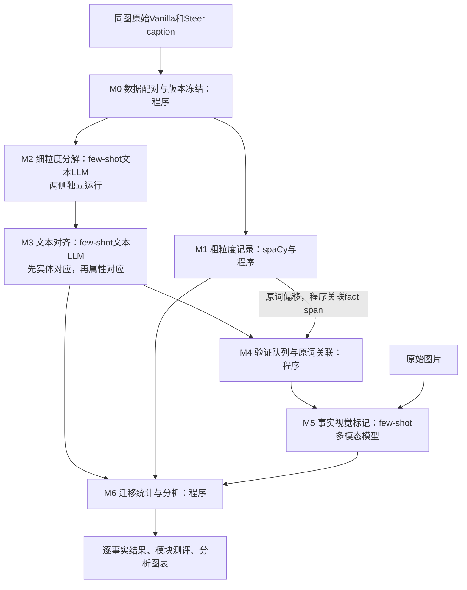

# 双粒度分解、对齐与视觉标记：模块构建规划

日期：2026-09-12。状态：构建规划，未实现、未运行新实验。

本文件是下一步模块构建的主入口。相较此前研究方案，本版优先固定类别、few-shot示例和单变量实验方式；后续更复杂的机制分析和steering改进暂不进入构建阶段。范围冲突时，以本文件的首版合同为准。历史输出不覆盖。

## 1. 目标与固定原则

分析同图Vanilla/Steer输出中，实体和属性被保留、删除、新增或修改，以及这些事实是否得到图像支持。

- 粗粒度＝词语/POS及caption统计；细粒度＝实体、属性原子事实。这里的粗/细是本项目约定，不表示两个连续的LLM拆解步骤。
- 保留 decompose → align → 多模态逐事实标记。粗粒度记录通过原文位置连接到细粒度事实，用于最终分析。
- 首版只保留两个事实主类：entity、attribute。先把类别边界和示例审核明确，再实现提示词。
- 所有生成式模型判断必须使用冻结的few-shot。NLP工具、字段校验、统计计算不调用生成式LLM。
- 每轮只改变一个预先写明的因素。上游变化后，不能把下游分数变化直接归因于下游能力。
- 不新增LLM Coverage、独立语义去重器、独立指代模块、反复自修复或自动改prompt循环。

## 2. 架构图



核心路径：`原文 → M2 → M3 → M4 → M5 → M6`。

旁路：`原文 → M1 → 原词/事实关联及M6分析`。M1的POS、词频和长度**首版不输入M2/M3/M5的提示词**，避免同时引入“增加NLP特征是否改变模型判断”的变量。M2/M3不看图片；M5不回写文本分解和对齐。

## 3. 模块、数据与参与程度总览

| 模块 | 记录的数据 | 后面是否使用、怎么使用 | 生成式LLM参与 |
|---|---|---|---|
| M0 配对与冻结 | pair/image ID、原文、图片路径、方法与解码配置、数据/代码/prompt/示例版本、异常状态 | ID连接全部结果；原文送M1/M2；方法名只用于统计，不送判断模型 | 无 |
| M1 粗粒度记录 | 原词、lemma、POS、字符偏移、句号位置、词数、词频、空输出/重复退化标记 | 偏移在M4关联事实；POS、位置、词频和长度在M6分层分析；不决定事实类别、真假或对齐 | 无；spaCy使用固定预训练NLP组件 |
| M2 细粒度分解 | 实体锚点、属性槽和值、原文证据、事实ID、范围外/待审记录 | 实体/属性进入M3；完整事实进入M5；证据连接M1；唯一事实数进入M6 | 文本LLM，每caption一次，固定few-shot |
| M3 文本对齐 | 实体对应、事实对应、retained/removed/added/modified/unresolved、原因和证据 | 对应关系供M4构造共享验证项；状态与M5标签在M6组合为真假迁移 | 文本LLM，每pair一次，固定few-shot；一个响应内先实体后属性 |
| M4 关联与验证队列 | claim_id、两侧fact_id、完整待验命题、主体语境、fact→token链接、共享关系 | 向M5派发唯一事实；为M6回填真假与POS、位置提供索引 | 无 |
| M5 视觉标记 | supported/hallucinated/uncertain、简短依据、模型/示例版本、技术失败 | 与M3合并得到真实删除、幻觉删除等；对新增和修改同样评价 | 多模态模型，每待验claim一次判断，固定图文few-shot |
| M6 统计与分析 | 逐事实真假迁移、每图汇总、模块误差与未决分布、图表 | 产生研究观察和后续单变量干预假设；不反馈修改本轮输出 | 无；总结可由研究者撰写 |

请求预算原则：每pair约2次decompose＋1次align，再加Q个唯一claim的视觉判断。Q由真实分解/对齐确定；模型批处理只是执行优化，首版保持固定batch方式，不能同时改变prompt和批次组织。已有共享事实只验证一次。

## 4. M0：输入、配对与实验冻结

**输入/记录：** 原文、image_id、pair_id、模型与解码配置、图片路径、数据划分、每模块模型版本、prompt版本、few-shot文件哈希及顺序、运行参数。

**用途：** 保证两侧同图，所有结果可复算；记录重试、缓存命中和失败，不悄悄丢样本。当前greedy两侧各500条，ID一一对应，但原始行只有image_id/caption。实际EOS、token概率和停止原因缺失时记录unknown，不能由空文本补造。

**指标：** 重复ID数、配对覆盖率、图片可读取率、预期样本与落盘样本一致率、版本一致性、静默丢样本数。已知应配对的数据要求100%可追踪，异常样本显式保留。

**测评方式：** 程序检查，不需要LLM。所有后续模块沿用同一冻结清单。

## 5. M1：粗粒度记录

**记录：**

- token表：`caption_id, token_id, text, lemma, upos, char_start/end, word_index, sentence_id`。
- caption表：词数、句数、各POS数量与比例、lemma频次、空输出和重复退化状态。
- 原词/偏移由分词结果和程序得到；lemma、POS、句界由固定spaCy模型得到。词面重复用Counter，不把词频当同实体重复。

**后续参与：**

1. M4按M2的原文证据与词偏移相交，关联`fact_id→token_ids`。
2. M6统计“被删除的真实属性由什么POS表达、首次出现在哪一段”。属性使用value span，避免每条属性都把对象名词计入。
3. 原文片段用于高亮审核；词频用于描述词面重复变化。需要“语义重复”时，只复用M2已经明确的重复证据，不另开模型判断。

**不参与：** 不把POS喂给M2做类别提示；不让NOUN=entity、ADJ=attribute；不参与图像真假判断；不强制做全词表跨文本对齐。

**指标：**

| 指标 | 测什么 |
|---|---|
| 原词切片一致率、偏移有效率 | 记录能否逐字回指原文，工程目标100% |
| POS准确率/混淆表 | 在小规模独立人工标词集上检查，特别是ADJ/NOUN/VERB边界 |
| lemma准确率、句界错误数 | 小样本人工核对，不用“程序运行成功”代替准确率 |
| 统计复算一致率、同版本重复结果一致性 | 数量、比例、位置能否确定性复算 |

零词输出的密度/位置为N/A。固定spaCy版本、语言模型和分词口径；首版不比较多个NLP模型。

## 6. M2：细粒度分解

**职责：** 只回答“当前caption明确表达了哪些范围内的实体和属性”。两侧独立拆解，不看对侧、图片、方法名。

**记录：**

- entity：`entity_id, canonical, mention/evidence_spans`；这是对象指代锚点，不是NER人名识别。
- fact：`fact_id, type, entity_id, slot, value, source_quote, source_spans`。entity事实表达对象存在；attribute必须绑定实体，一个槽位的一项值独立记录。
- 实体完整提及span与属性值span分别保存；多个独立属性不可藏在一个长句fact里。
- 明确重复事实只计一个语义单位，保留多个证据片段。否定、推测、范围不明确等保留原文和reason，按下述首版范围处理。
- 模型给原文引文，程序回查偏移。引文不存在或多处出现且无法确定时，局部待审；不猜位置，不整对丢弃。

**类别合同（实施前需连同例子固定）：**

| 类别 | 首版纳入 | 明确不纳入/不混入 |
|---|---|---|
| entity | 明确提及的人、动物、物体、场景对象的存在 | 颜色/材质不是额外实体；不把名词词数当对象数 |
| attribute/color | red、blue等颜色 | 不等同于全部ADJ |
| attribute/material | wooden、made of wood等材质 | 不额外生成wood对象；语境确实单独提到木料时另论 |
| attribute/size | small、large等直接大小修饰 | 不纳入物体间比较关系 |
| attribute/shape | round、square等形状 | 不把用途、种类归成形状 |
| attribute/state | 首版固定明确状态，如open/closed、wet/dry、broken/intact | running、sitting等动作/姿态不临时塞入state |
| out_of_scope | 动作、关系、数量、评价等范围外表达 | 它是审计状态，不是第三类事实，也不表示幻觉 |
| needs_review | 类型、主体、来源或范围无法明确 | 与out_of_scope及技术失败分别记录 |

为了控制变量，首版主分析限定明确肯定的描述性命题。否定/推测作用域及复杂类别泛化保留待审/范围标签，暂不进入主真假迁移；如后续扩展，必须另开协议版本和独立实验。不能把范围外内容的未抽取误算漏召回，也不能据此宣称全文覆盖。

**few-shot：** 使用固定8-shot起始配置（延续旧实验常用配置，不宣称8条最优）。每条明确输入、预期实体/属性、排除项及边界说明；示例在第10节列出。初始示例必须经人工审核，不能拿模型输出自动当答案。

**指标：**

- 原子事实＋主类联合P/R/F1，分别报告entity、attribute及各属性slot；匹配要检查主体、slot和值，不只比较字符串。
- 属性召回率、错误合并率、范围外误纳入率；单独统计真实长句修饰语遗漏。一个合并fact最多匹配一个主参考原子单元，不能凭包含多个关键词赚多个TP。
- 实体绑定准确率、来源span有效率、范围分流混淆表、待审比例、技术失败比例。
- 固定输入独立重复3次的语义一致性；忽略顺序/本地ID，不能把缓存重放当重复实验。
- 同义改写一致性仅作辅助；两个输出共同漏掉属性，仍算召回错误。

**隔离测评：** 用独立人工原文标注评价M2；不先经过align或视觉模型。真实短/长caption分别给指标，合成最小对照仅测边界，不代替真实集验收。

## 7. M3：文本对齐

**输入：** 两侧完整原文＋冻结的实体/属性；不看图片与真假。

**一次few-shot响应内的逻辑顺序：** 先给实体对应，再依据对应主体比较属性。两张输出表分开校验、分别测评，不额外新增实体对齐LLM调用。一个局部对应失败只阻断依赖它的事实。

**状态严格定义：**

| 状态 | 唯一定义 | 例子 |
|---|---|---|
| retained | 同一确定主体、完整等义命题 | wooden → made of wood |
| removed | 原侧有、完整对侧原文未表达 | red car → car：red删除 |
| added | 对侧新增命题 | car → red car：red新增 |
| modified | 同一确定主体、同一个属性slot，明确值改变 | red → blue |
| unresolved | 身份/粒度/来源/抽取缺口无法确定 | 两个同类对象无法确定对应；对侧原文有red但未抽到 |

首版modified只用于属性同槽值变化，不扩到动作阶段、关系目标、语气、实体类别泛化。material=wood → color=red是removed＋added；不因为“都描述同一物体”判modified。实体dog→animal等粒度变化首版标unresolved/granularity，并保留原因，不扩大定义追求覆盖。

**后续参与：** 状态送M6；retained共享关系送M4减少重复视觉验证；removed/added/modified各自保留待验事实。属性删除附原因：`entity_absent`或`attribute_omitted`，不能混为一类损伤。

**指标：**

- 实体对应P/R/F1；事实Edge F1；Edge＋Status联合F1；各状态P/R/F1与Macro-F1。
- Removed Precision和确认误删除率FRR：预测removed中对侧原文仍表达的比例；不能简单等同于1−Removed Precision。
- extraction_gap P/R/F1；语义未决比例、技术失败事实比例、参考可判定却被错误排除的比例。
- 每fact恰好分配一次、非法ID/重复配对数；独立重复3次的配对与状态一致性。

**隔离测评：** 首先使用同一份人工事实输入测试align。之后才换成冻结M2输出测端到端误差，单独出表。参考事实不能因模型输出unresolved就从分母消失；技术失败不能算正确unresolved。没有样本的状态记N/A并报告support，不造完整Macro-F1。

## 8. M4与M5：验证队列、原词关联和多模态标记

### M4：纯程序组装

**记录/用途：** `claim_id, image_id, fact_ids, statement, entity_context, token_links, queue_status`。只按M3已确认的等义对应共享claim，不进行新的语义猜测。属性命题必须明确主体；使用确定模板组合已有字段，不额外调用LLM重写。

- retained：同图、同主体、完整等义，验证一次回填两侧。
- removed/added：分别验证原侧/新侧命题。
- modified：前后两个值分别验证。
- 对齐未决但事实本身明确：可分别视觉验证，迁移仍未决；结构坏数据显式留待审。
- M1词偏移与M2的source/value span关联；绑定不成功只影响POS切片，不抹掉可用事实的视觉结果。

**指标：** 合法ID率、可用事实验证队列覆盖率、共享映射一致率、无重复主计数、跨度关联成功率、局部失败隔离、回填一致率。工程不变量应100%满足；语义正确性不能靠这些指标证明。

### M5：few-shot多模态模型

**输入：** 原图＋完整原子事实＋必要主体定位语境＋固定图文示例。隐藏方法名、retained/removed状态和预期结论。定位语境不能预设被验证属性成立，模型不得把caption其他主张当图像真值。

**记录：** `claim_id, label, short_reason, verifier/prompt/shots_version, technical_status`。

| 标签 | 定义 | 必须覆盖的图文示例 |
|---|---|---|
| supported | 指定主体与命题得到图像明确支持 | 清晰红车＋“该车是红色的” |
| hallucinated | 主体明确不存在或属性明确与图像矛盾 | 清晰红车＋“该车是蓝色的”；明确不存在的对象 |
| uncertain | 图像证据不足或无法定位指定主体 | 灰度图判断实际颜色；严重遮挡；多个对象指代不明 |

参考FaithScore的原子事实图像一致性验证。本地参考实现stage3采用yes/no；三值标签是本项目扩展，不直接称为原版FaithScore复现。[论文](https://aclanthology.org/2024.findings-emnlp.290/)

**few-shot：** 起始固定6个图文实例，entity与attribute各覆盖三种标签；先人工审核真实图片与答案，再固定顺序。上表只是选例标准，不是已经审核完成的视觉示例。只有文字“假设图片是……”不能替代实际图文few-shot；测试图片及其裁剪、同图其他命题不进入示例。

**减LLM原则：** 一个模型、一套提示词、一次判断；不增加多模型投票/反思器。共享事实复用结果。短理由仅供审核，不生成长推理链；不把模型自报confidence当校准置信度。

**指标：**

- 独立人工图像事实参考上的三类Macro-F1、混淆矩阵，以及entity/attribute分项；重点看Supported Precision、Hallucinated Precision/Recall。
- 误判真率：人工hallucinated被判supported的比例；误判假率：人工supported被判hallucinated的比例。均列分子/分母。
- uncertain率、已判断覆盖率及已判断部分错误率并列；不能全部uncertain来获得虚假低错误率。
- 技术失败率、独立重复标签一致率、每claim耗时/成本。重复一致性不等于真实性。

**隔离测评：** 用固定人工事实、固定图片和固定主体语境单测M5，不让decompose/align变化污染指标。助手起草参考只能叫候选标签，经人工审核才作gold。困难例可单独成测试集，不能用过采样频率估计总体。

## 9. M6：统计、模块审计与最终分析

**输入：** M3迁移状态＋M5视觉标签＋M1语言记录，以fact/claim ID连接。不调用LLM计算指标。

**产物：**

1. `transitions.csv`：entity/attribute × retained/removed/added/modified × 视觉真假；modified列前后两侧真假，unresolved/uncertain/技术失败单独保留。
2. `pair_metrics.csv`：每图长度、事实增删、真假变化、对象仍在时的真实属性保留；新增真实信息和新幻觉都统计。
3. `module_report.md`：每模块的准确性、覆盖、失败和重复稳定性；区分单模块与端到端结果。
4. 首批三图：长度变化×真实实体/属性保留；真实属性删除按对象退出/对象仍在分解；POS/原始位置×真假迁移。

**分析指标与工程指标分开：**

- 真实保留/删除率、幻觉保留/删除率；新增真实事实数、新幻觉数；修改纠错与真→假另列。
- 实体仍对应条件下的真实属性保留率，并列全部原属性状态，避免只看幸存对象。
- POS绝对数/每100词频次、唯一事实数与每100词真实事实密度并列；不能靠变短提高密度就宣布信息完整。
- 零分母=N/A；明确“真假”为视觉模型判断，并列人工审核误差。未决状态不能从名册隐藏。
- 对原侧被判supported的N条事实，确认删除率下界=D/N、上界=(D+U)/N，U为这些事实的迁移未决数；原侧视觉uncertain另报，不假装该区间覆盖其未知真假。
- 以image为单位配对bootstrap给区间，不能把同图多个fact当独立样本；统计差异不是EOS或内容抑制的因果证明。

**M6自身测评：** 固定人工小样本的手工统计与程序结果逐项相符；类别计数守恒、每fact唯一主计数、共享claim回填一致、异常/零分母处理正确。端到端再对人工标注的完整迁移表计算联合P/R/F1、真实删除识别P/R/F1、幻觉删除识别P/R/F1，避免只看到漂亮的状态分布。

## 10. few-shot示例设计：先定边界，再选例子

**每条例子必须写清：原始输入、完整预期输出、类别解释、容易错的相邻类别。** 实际prompt中的格式和规则保持固定；若是否加入边界解释本身要研究，另开一轮单变量对照。

### M2的8-shot覆盖草案

下表是待人工审核的示例内容草案，正式冻结前补齐ID和source span；不能把草案当已验证gold。

| # | 输入 | 应提取的核心事实 | 明确边界 |
|---|---|---|---|
| 1 | A car. | entity(car) | 不凭常识补颜色、大小 |
| 2 | A small red car. | entity(car)、size=small、color=red | small与red分开，不能藏在entity里 |
| 3 | A wooden table. | entity(table)、material=wood | wooden是属性；不另造wood实体 |
| 4 | A round table made of wood. | entity(table)、shape=round、material=wood | 材质可以用名词短语表达，类别不由POS决定 |
| 5 | An open door beside a chair. | entity(door)、entity(chair)、door.state=open | beside为范围外关系；open为明确状态 |
| 6 | A dog is running beside a wet bench. | entity(dog)、entity(bench)、bench.state=wet | running不归state；beside不归attribute |
| 7 | Two dogs stand beside a beautiful car. | dogs的明确群体提及、entity(car) | 不展开两个虚构实例，不生成count事实；stand/beautiful/beside范围外 |
| 8 | A red car is parked. The car is red. It may be blue. It is not green. | 同一car锚点、一个肯定color=red事实，保留两处证据；may be blue与not green保留范围外原文记录 | 不重复计red；不把推测blue、否定green当肯定颜色；parked首版不纳入state |

第8例故意同时展示明确陈述、重复、推测和否定的去向，用来固定范围边界；不能根据常识修正原文。它只是few-shot示范，不是用于识别单个因素作用的控制实验。正式边界测试另外使用每次只改变一个短语的最小对照，且与示例的改写族隔离。8条示例的具体措辞经人工审核后整套冻结，不能跑完测试后临时替换。

### M3的8-shot覆盖草案

| # | 两侧示例 | 预期状态/规则 |
|---|---|---|
| 1 | wooden table → table made of wood | 同一主体的材质retained |
| 2 | red car → car | color removed；entity retained |
| 3 | car → red car | color added；entity retained |
| 4 | red car → blue car | 同主体同color槽modified |
| 5 | wooden table → red table | material removed＋color added，非modified |
| 6 | car and bench → car | bench removed，相关属性归entity_absent |
| 7 | 两个同类对象→一个，无法确定是哪一个 | 身份依赖项unresolved，不强制匹配 |
| 8 | 两侧原文均有red，但一侧输入事实漏red | unresolved/extraction_gap，不能removed |

示例是人工构造控制用例，不是测评集。M5的6例必须使用真实图片，覆盖三类视觉判断。示例数量固定只是起始工程选择，后续shot数量效果必须另测。

### 数据隔离

- examples：用于few-shot；不进入验证/测试。
- development：看错误、提出一次修改；运行后不改本轮参考答案。
- validation：固定用于选择修改，频繁看过后不再称独立测试。
- held-out test：新图片和caption，在协议选择完成后评一次。旧20/30/40图及先前看过的样本只作开发/回归。
- 按image隔离，Vanilla/Steer、同图改写与不同解码输出归同一划分。最小对照句的改写族也隔离，不能训练例与测试例仅换一个名词。

## 11. 单变量构建顺序

### 固定基线

先人工审核类别合同、few-shot与一批参考。冻结每模块的模型版本、提示词、shot数量/内容/顺序、temperature、thinking设置、schema、过滤/重试策略、评测集和计分器。M2/M3先固定同一文本模型；M5固定一个多模态模型。首次端到端结果是基线描述，不是某个模块改善的因果证据。

### 每轮实验卡

```text
研究问题：例如，M2的一条原子化边界示例能否减少多属性合并？
唯一改动：仅替换指定示例；shot数量、顺序位置、总结构尽量保持一致。
固定项：模型、其他示例、规则、schema、参数、输入、参考、评分脚本。
输入：同一冻结真实caption开发集。
主指标：属性召回；保护指标：属性precision、错误合并率、待审与失败率。
重复：两条件均独立运行3次，样本相同；调用条件交错，减少时间漂移。
结论：只归因于这次示例替换这个整体处理，不宣称单独识别了长度或措辞效应。
```

一次换例子可能改变措辞、覆盖内容和token长度；若要分离这些因素，需要后续更严格匹配对照，不能把“只改一个文件”当作只改一个概念变量。

### 实施顺序与禁止混改

| 顺序 | 先做什么 | 本轮允许改变 | 必须固定 |
|---|---|---|---|
| 1 | M0/M1/M4/M6工程记录与复算 | 当前一个确定性工程问题 | 语义规则与模型输出夹具 |
| 2 | M2独立测评 | 例如一条few-shot边界示例 | 其余模型/prompt/schema/数据/指标；不运行新align“证明改进” |
| 3 | M3独立测评 | 一个对齐示例或一条边界规则，二选一 | 人工事实输入、原文、参考、其他配置 |
| 4 | M5独立测评 | 一组明确的视觉示例替换，或模型选择，二选一 | 人工事实、图片、主体语境和评分 |
| 5 | 固定模块串联 | 不改模型因素，测误差传播 | 三个模型模块、输入清单和参考 |
| 6 | 形成研究观察 | 一个预先指定切片/比较 | 已冻结pipeline；分析结果不能反向改本轮答案 |

如果要测shot数量：8-shot生产基线保留，另建有few-shot的匹配对照（如固定4-shot子集对8-shot），其他条件相同；结论是该具体示例集合/数量的整体作用，不能声称纯数量效应。首版无需引入0-shot生产链。

如果要测schema改变：先定义新的任务合同和参考，再用同一新口径重评两版本；标为协议迁移实验，不与示例改进混做。prompt与schema通常有接口依赖，必须改动时不能假装只改变了单个因素。

**构建阶段不扫steering强度、解码方式、生成模型、数据集等实验轴。** 先固定greedy和一组Vanilla/Steer结果建立测量可靠性。只有流水线冻结后，才研究一个生成因素，例如steering强度，其他生成和评测设置保持一致。

## 12. 验收重点与历史依据

| 上次记录 | 本次必须避免 |
|---|---|
| v6合成8句主线联合F1=97.8%，真实长句仍漏属性/合并命题 | 用独立真实caption分层召回验收；不拿简单句高分代表可用 |
| 同义/重复一致性高但存在共同遗漏 | 正确性与稳定性分开，二者都报告 |
| v1.3主线Edge F1 92.02%→87.52%，技术失败事实比例4.55%→12.25% | 不能只看某一状态变好；局部失败隔离，完整分母保留 |
| modified F1=48.78%，参考本身仍有边界争议 | 首版只做同主体同属性槽值变化；先审示例与参考 |
| 旧样本参与规则开发、部分参考为助手标注 | 候选参考不称人工gold；设未见图像测试集 |

历史数字来自旧类别/数据口径，仅解释设计教训，不能作为本版entity/attribute简化协议的可比基线。

首版验收不预设“达到某个漂亮总分就通过”：工程不变量必须满足；真实集属性召回、删除precision、视觉误判真/假和未决比例要分别过审。误差与后续拟分析效应同量级时，先修测量，不扩研究结论。具体最低可接受误差与标注规模在首批校准后、正式确认实验前写入冻结实验卡。

## 13. 第一轮交付清单

```text
protocol.md                 # 类别/状态/边界、字段和分母
shots/decompose.jsonl        # 完整few-shot输入输出及证据
shots/align.jsonl            # 完整pair/facts/对齐示范
shots/verify_manifest.jsonl  # 图文few-shot路径、命题、标签及人工审核
splits.json                 # 按image和改写族隔离的划分
run_manifest.json           # 模型、参数、prompt、shot与代码版本
captions.csv / tokens.jsonl  # 粗粒度记录
facts.jsonl                 # 细粒度分解
alignment.jsonl             # 配对与状态
verification_queue.jsonl     # 唯一claim与回填关系
verification.jsonl          # 多模态标记
transitions.csv             # 真假迁移
module_report.md            # 独立测评、串联误差、下一轮唯一变量
```

下一步首先完成并审核类别合同和few-shot示例；这一步完成之前不批量调用模型。此处是明确建设顺序，不代表要求再次确认已获授权的普通实现操作。

### 参考记录

- [v6首次实验报告](../outputs/semantic_core_v6/experiment_v1/TEST_REPORT.md)
- [v1.3对齐复测](../outputs/alignment_core_v13/experiment_v1/TEST_REPORT.md)
- [既有对齐指标口径](../evaluation/METRICS.md)
- [FaithScore论文](https://aclanthology.org/2024.findings-emnlp.290/)
- [词语与视觉标记协议](LEXICAL_AND_VISUAL_PROTOCOL.md)
