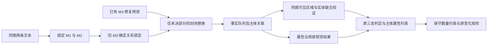

# v5 结构优化与测评报告

**目标尚未达到：较稳妥候选为 322/400＝80.50%，比上一轮 292/400＝73.00% 净增加 30 对，距 90% 还差 38 对。** 完整联合方案最高为 323/400，但旧标注测试发现属性判断下降，因此不采用它整体替换原视觉模块。覆盖率不等于语义准确率。

## 问题定位与结构修改

### 1. 整对重写对齐会破坏已确定的关系

此前将新 M3 的整对输出替换旧版，结构错误减少却带来大量退化。这次改为只允许替换旧 unresolved 引用集合内的对应关系：

- 已确定的主体对应和事实事件作为不可修改约束；候选不能引用这些被锁定的 ID。
- 候选必须满足原主体、属性槽、引文、唯一引用与完整覆盖校验。
- 校验若改变任何已确定关系，拒绝该次替换；通过后逐条恢复旧确定行，保留原证据和原因。
- 不按视觉标签、参考答案或矩阵是否成功来选择替换。候选使用已完成的 v4 修复预测，本轮没有新增 M3 调用。

400 对中有 71 对通过局部替换校验，9 对替换被拒绝，320 对没有可用的封闭替换。单独使用该改动：292→304，对应 12 对恢复、0 对退化。

### 2. 逐条视觉验证缺少共同的主体定位

同图主体与属性原来分别定位，可能引用不同物体。新条件先输出少量可见区域，再让同图相关命题引用区域 ID；主体和支持它的属性必须引用相同区域。区域是模型观察结果，并非人工验证的定位真值。

- 一次请求提供同图的未决命题、冲突相关主体及原文定位上下文，不提供旧标签或参考答案。
- 保持原 supported/hallucinated/uncertain 证据规则。主体未决、区域不一致，不能支持属性。
- 固定原 6 张图文示例。其中 3 个属性示例增加明确的主体行，演示主体支持且属性支持、属性矛盾、属性不确定这三种组合。不是增加测试答案到提示中。
- 主实验 117 张既有 COCO 图、227 个查询，117 次 Flash 调用。覆盖全部 400 对中的符合条件查询，而非只挑会提高指标的图片。

### 3. 搜寻区域与目标区域是不同概念

15 条输出明确写 not_found、目标 bbox=null，却引用了搜寻过的厨房/背景区域。旧联合校验把它当目标区域绑定矛盾，导致结构失败。

新的适配只在 **显式 not_found＋bbox=null＋区域 ID 确实存在** 时，将该 ID 记录为 searched_region_id，目标 region_id 保持 null。原证据判定不变；图像受限仍是 uncertain，不会因记录了搜寻区域就自动判幻觉。全部 15 条得到结构处理，只额外恢复 1 对矩阵样本。

### 4. 区域清单必须有数量上限

旧标注测试的一次请求反复枚举 155 个相同房间背景区域，触及输出长度上限，影响 9 条命题。新增区域预算：最多列出与查询数量相同的区域，重复指称复用已有 ID，并限制无关场景清单。

只对这个已确定返回 finish_reason=length 的请求做一次有上限的补测，9 条均得到可处理输出。原失败响应保留，没有用参考标签筛选重试结果。该回退只完成了一例在线测试，不能宣称它在其他批次已经全面验证。

## 架构

该图对应最终较稳妥候选。完整联合属性条件作为独立对照保存；M2、POS、事实范围、所有 400 对分母均不改变。

## 400 对单变量与组合结果

| 条件 | 可计入 | 比例 | 相对 292 恢复/退化 |
|---|---:|---:|---:|
| 本轮起点 | 292 | 73.00% | — |
| 仅替换未决对齐部分 | 304 | 76.00% | 12/0 |
| 仅联合视觉，严格原区域校验 | 311 | 77.75% | 22/3 |
| 联合视觉＋搜寻区域区分 | 312 | 78.00% | 23/3 |
| 局部对齐＋完整联合视觉＋区域区分 | 323 | 80.75% | 34/3 |
| **局部对齐＋实体联合验证＋属性保留原方法** | **322** | **80.50%** | **33/3** |

没有删除困难样本，没有把 uncertain 统改成 hallucinated，也没有用新增事实抵消丢失事实。已确定格子之间没有发生变化；3 对退化为未决是新增视觉证据与旧决定存在冲突。

3 个退化 ID 为 54264、581451、140010。它们保留为未决，没有回退到更有利于覆盖率的旧标签。

## 复用原来 39 图、579 条标注的检查

使用 `outputs/final_v1_m5/references.jsonl` 的全部 579 条旧参考，其中实体 508、属性 71；查询沿用原 typed 路由对应的原图、命题和上下文。参考标签、理由、对齐答案没有进入请求。

579 条按图像分批，每批最多 12 条，共 68 次调用，另有上述 1 次长度回退。旧数据缺少可靠统一主体 ID，因此该兼容性测评没有凭猜测补父子边；生产 400 对实验保留真实派生的父子引用。此差异需要在解释测评时保留。

| 旧参考一致率 | 原方法 | 完整联合方法（含一次长度回退） |
|---|---:|---:|
| 实体 | 434/508＝85.43% | 434/508＝85.43% |
| 属性 | 63/71＝88.73% | 59/71＝83.10% |
| 合计 | 497/579＝85.84% | 493/579＝85.15% |

回退前实体为 429/508、属性为 58/71，9 条技术失败已计入分母；修复后没有技术失败，但联合属性的参考一致率仍低于原方法。

因此最终采用固定输入类型路由：实体取联合结果，属性保留原方法。对这套旧参考做对应类型组合，实体仍为 434/508，属性为原来的 63/71，合计 497/579。**这是根据本轮开发测评选择的组合，并非独立留出集验证；不能称为新的真实准确率提升或证明实体已经达到 90%。**

## 剩余问题与 90% 的差距

最终仍有 78 对未决。问题在同一对中可以重叠：42 对涉及视觉未决、30 对涉及语义未决、27 对涉及技术依赖、11 对涉及 M2 缺失成分；另外 5 对有保留事实标签冲突。

- 视觉端：细分类食材、隐藏材质、缺少比较尺度的大小、低细节区域，仍缺乏足够证据。继续强行二分类会伤害准确率。
- 语义端：群体与个体的指称、部分与整体、二选一文本、泛化与身份仍需明确的标注边界。
- 技术依赖：不全是 JSON 错误，还包括被隔离的 M2 引文/归属缺口。现在不再通过重写整对关系来掩盖它们。

下一轮最应优先处理的是 M2 缺口和群体指称的独立参考审核，并固定这些边界后做局部测试。不能承诺仅继续重复视觉调用就能补足剩余 38 对，也不能把更高可判定率当作更高语义准确率。

## 测试与审计

- 本轮主实验 117 次、旧参考测试 68 次、一次长度回退：**共 186 次新增 Flash 调用**；局部对齐与组合重算新增调用为 0。
- 新增 16 项不同本地测试通过，覆盖区域重复/缺失、目标与搜寻区域、主体约束、未知引用、锁定关系、完整事实覆盖及区域预算。
- 主实验输入、提示、示例和代码被冻结；117 个响应 ID 唯一，234 个检查点校验和通过。
- M2 输出和 5959 条接受事实保持不变；原 M3 所有确定行逐条验证未改动；属性保留路由还逐条验证原属性视觉记录未被替换。
- 新代码位于 `experiments/visual_graph_v5/`。所有方案与原结果分目录保存，旧冻结框架未覆盖；本轮仍是候选版本，尚未晋升为已证明准确的新默认版本。

## 主要产物

- `entity_graph_attribute_frozen/matrix.csv`：较稳妥候选的 400 对矩阵。
- `entity_graph_attribute_frozen/remaining_cases.jsonl`：最终 78 对未决及文本、对齐、统计状态。
- `entity_graph_attribute_frozen/transitions.jsonl`：33 对恢复、3 对退化的逐对索引。
- `final_comparison.json`：完整联合条件与单模块对照；固定类型路由的比较另见其目录下 comparison.json。
- `legacy579/paired_with_fallback.jsonl`：579 条参考、旧预测、新预测及技术回退状态；参考始终保留在本地。
- `search_binding_audit.jsonl`：15 条搜寻区域与目标区域的区分记录。
