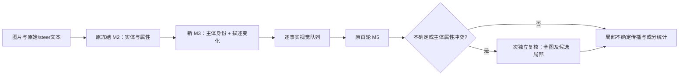

# 修订候选框架

公开发布导航：[安装运行](../../README.md)、[实验说明](../../docs/EXPERIMENTS.md)、[已打包的最新报告](../../results/coco400_revision_v2_guard/RESULTS.md)。下文 `outputs/` 报告路径描述原完整实验工作区；公开包中汇总转存于 `results/`，原始检查点未全部入库。

原 Final v1 与 COCO 400 冻结结果不修改。正式对比在 `outputs/coco400_revision_v2_guard/RESULTS.md`；初版反例失败及中断调用在 `outputs/coco400_revision_v2` 保留。



`end_to_end.run_full` 接受任意合法配对输入，不限定 400 张；M2 两次/对，M3 一次/对，M5 一次/唯一命题，只有命中复核条件的命题额外一次。此入口已通过带真实图片读取、阻断网络的集成与恢复测试。本轮 400 对实验为隔离变量复用旧 M2/首轮视觉响应，不宣称整个新版已经重新生成所有首轮输出。

```powershell
.venv/Scripts/python.exe -m experiments.coco400_revision_v2.end_to_end --pairs inputs/pairs.jsonl --output outputs/new_revision_run
```

同目录恢复增加 `--resume`；输入、代码或配置改变时必须使用新输出目录。

| 模块 | 数据与用途 | LLM 参与 | 本轮检验 |
|---|---|---|---|
| observation.py | 原问题、局部影响、各成分候选状态、增删/改写事件；用于矩阵及覆盖统计 | 无 | 原 400 对重算 + 边界测试 |
| alignment.py / guard.py | 主体映射、description_change、事实映射与证据冲突理由；用于属性归属和队列共享决策 | Flash，8-shot，一次/对 | 400 对新调用，合成回归 8/8；未提供真实准确率 |
| local_alignment.py | 冲突行原文及隔离原因；只降为未决，不猜测合法答案 | 无 | 局部冲突测试、原响应离线回放 |
| visual.py | 复核原始证据、定位框、限制、前后判定与响应 ID；用于严格主体支持统计 | Flash，原6-shot，额外一次/选中命题 | 506 次有效响应；原 uncertain 330 条中117条转为确定，尚非正确性证明 |
| pipeline.py / end_to_end.py | 首轮、复核、最终账本分开；支持新输入与断点恢复 | 编排上述调用 | 28项离线测试通过 |

类别泛化/具体化按变化事件记录，不能当成同义保留，也不能把泛化后的描述称为新增独立信息。M3 技术未决存在回归，此候选尚未通过真实语义准确率验收，旧入口保持不变。
