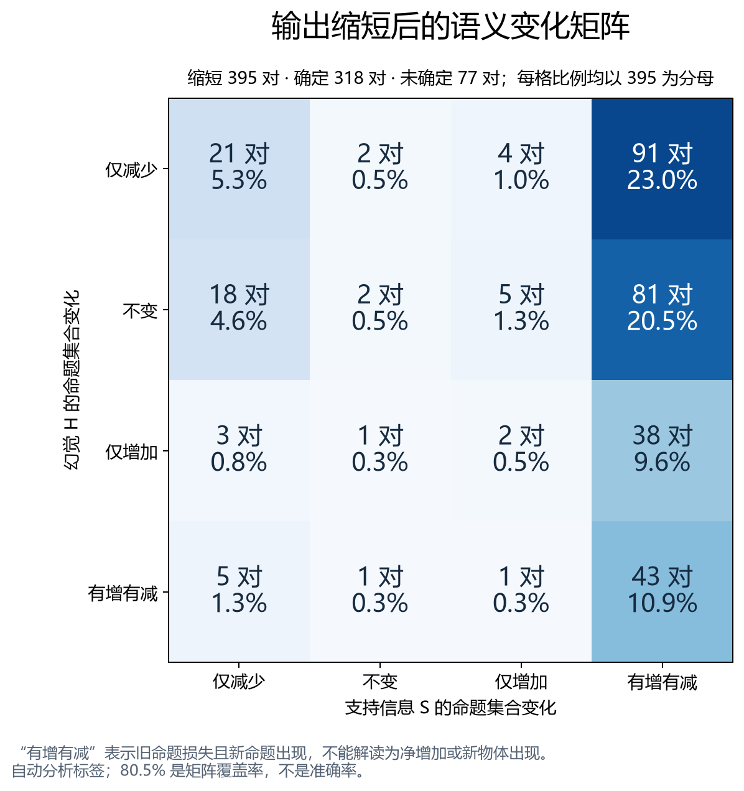
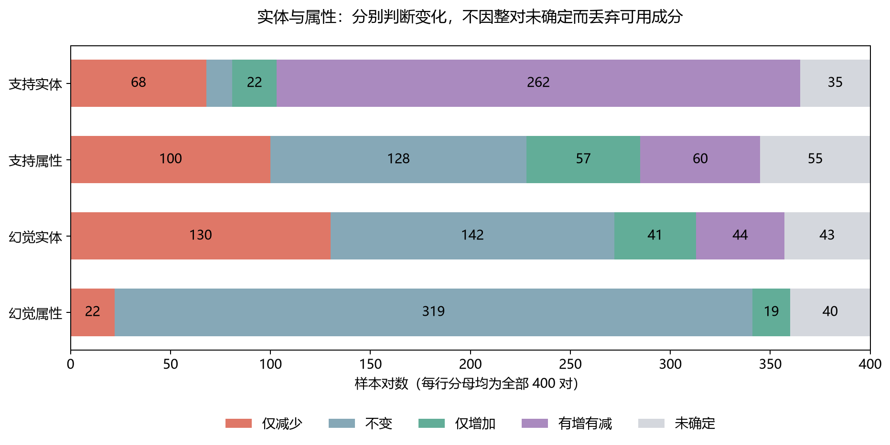
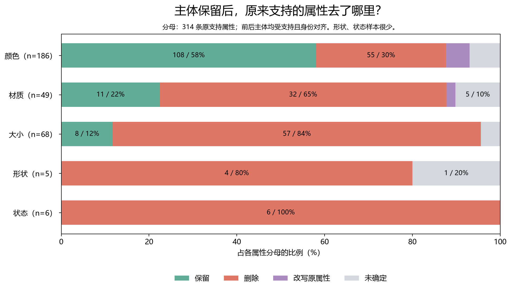
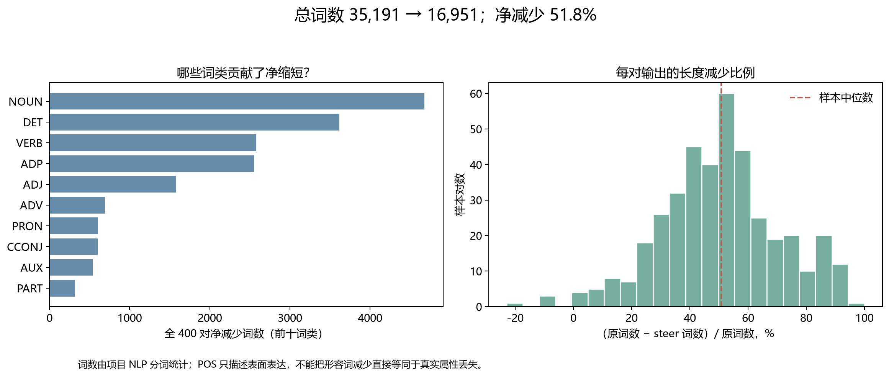

# 当前矩阵与成分分析：COCO 400 对，保守 v5 版本

本轮从冻结结果重新计算统计，未调用 LLM、未修改分解、对齐或视觉标签。当前数据已经呈现三个值得追踪的现象：**缩短伴随支持命题重组；主体保留后仍损失属性；不同属性类型受到的影响不同。** 这些是寻找 steer 改进动机的描述性证据，尚不是因果结论。

## 1. 数据版本与指标口径

输入为 `outputs/visual_graph_v5/entity_graph_attribute_frozen/pairs.jsonl`，使用实体联合视觉复审、属性沿用冻结结果的保守方案；不是另一份 323 对可分类的全联合方案。

| 项目 | 当前结果 |
|---|---:|
| 配对图文样本 | 400 对 |
| 整体矩阵可确定 | 322 / 400，80.5% |
| 整体矩阵未确定 | 78 / 400，19.5% |
| 输出缩短 | 395 对；其中 318 对可入矩阵，77 对未确定 |
| 输出长度不变 | 1 对，可入矩阵 |
| 输出变长 | 4 对；3 对可入矩阵，1 对未确定 |
| 总词数 | 35,191 → 16,951，净减少 51.83% |
| 每对长度减少比例的均值 / 中位数 | 50.48% / 50.81% |

80.5% 是**覆盖率**，不代表正确率。当前 400 对没有独立人工金标准；旧标注测评的一致率也不能当成这里的矩阵准确率。

S 表示被当前框架判断为图像支持的实体、属性命题，H 表示判为幻觉的命题。它们不覆盖图像中的全部真实信息，也不覆盖文本中的全部动作、关系及叙事。

四种状态是集合变化：不变；仅损失；仅新增；既损失又新增。“有增有减”不表示净数量增加，也不必然意味着换了物理对象；同一对象的泛化、细化会改变命题。未确定不归入“不变”，也不强行归为幻觉。父实体为幻觉时，其属性不重复计入独立属性幻觉；父实体不确定时，属性的严格真假归属也受限。

## 2. 核心矩阵：缩短究竟伴随什么

以下每格比例以全部 **395 对缩短样本**为分母，保留 77 对未确定在分母中。

| 幻觉 H 变化 / 支持信息 S 变化 | 仅减少 | 不变 | 仅增加 | 有增有减 |
|---|---:|---:|---:|---:|
| 仅减少 | 21（5.32%） | 2（0.51%） | 4（1.01%） | 91（23.04%） |
| 不变 | 18（4.56%） | 2（0.51%） | 5（1.27%） | 81（20.51%） |
| 仅增加 | 3（0.76%） | 1（0.25%） | 2（0.51%） | 38（9.62%） |
| 有增有减 | 5（1.27%） | 1（0.25%） | 1（0.25%） | 43（10.89%） |

**第一，支持命题重组非常常见。** “S 有增有减”共 253 对，占全部缩短样本 64.05%；若只看已确定的 318 对，则为 79.56%。这支持把“信息替换、描述粒度改变”单列分析，不能只统计净事实数。这个比例是当前自动标签下已识别现象的占比，不是考虑标签错误后的总体下界。

**第二，缩短不能只用当前识别出的幻觉减少来概括。** H 不变且 S 状态也已确定的有 106 对，占缩短样本 26.84%。其中，你最关注的 H 不变且 S 有增有减有 81 对：

| 81 对内部的幻觉状态 | 对数 |
|---|---:|
| 当前实体与属性命题前后均被确认无幻觉 | 72 |
| 有已知幻觉，前后集合不变 | 8 |
| 变化方向确定，但视觉成员资格仍有不确定 | 1 |

这 72 对占全部缩短样本 18.23%。即使当前识别出的实体、属性幻觉前后为零，文本仍缩短且支持命题发生变化。这是可用于 motivation 的观察；不能延伸成“整段文本完全无幻觉”或“已证明具体缩短机制”。另外，H 单轴可确定为不变的缩短样本共有 112 对；其中 6 对的 S 轴未确定，因此没有进入上述 106 对。

**第三，幻觉去除与支持信息保护尚未很好兼得。** H 仅减少的 118 对缩短样本中，112 对存在支持命题损失（21 对 S 仅减少、91 对 S 有增有减），仅 6 对确定没有支持命题损失。不能因此认定这 112 对整体变差：新出现的支持信息可能有价值，但损失代价不能被单一幻觉指标掩盖。

**第四，短回答仍会新增幻觉命题。** H 仅增加或有增有减共 94 对，占全部缩短样本 23.80%。其中有增有减不等于幻觉净增加；这项统计仅说明“有新幻觉出现”。

其余长度组很小：唯一等长样本属于 H 仅减少、S 有增有减；4 对变长样本分别为 H 仅减少/S 有增有减、H 不变/S 有增有减、H 仅增加/S 仅减少各 1 对，以及未确定 1 对。不能据此比较不同长度组的规律。

## 3. 实体与属性应分开看

| 成分 | 仅减少 | 不变 | 仅增加 | 有增有减 | 未确定 | 单成分覆盖率 |
|---|---:|---:|---:|---:|---:|---:|
| 支持实体命题 | 68 | 13 | 22 | 262 | 35 | 91.25% |
| 支持属性命题 | 100 | 128 | 57 | 60 | 55 | 86.25% |
| 幻觉实体命题 | 130 | 142 | 41 | 44 | 43 | 89.25% |
| 幻觉属性命题 | 22 | 319 | 19 | 0 | 40 | 90.00% |

每行分母均为 400。因此，整对矩阵未确定不意味着它的每个成分都不可分析。支持实体的变化覆盖率已经超过 90%，但同样不能解释为准确率超过 90%。属性“不变”也可能来自前后都没有该类命题，不应直接理解成属性保护良好。

### 将主体身份保留与实体描述命题保留区分开

原侧 2,339 条受支持的实体记录中，1,391 条主体身份匹配，833 条主体仅原侧出现，115 条身份未确定。身份保留比例的未确定上下界为 **59.47%—64.39%**。分母是抽取出的原实体记录，不是图像全部物体；这个身份指标只问是否匹配，不要求新描述也被视觉支持。

已保留身份的 1,391 条中，1,287 条描述等价、66 条泛化、38 条细化。主体保留但描述变化可以产生命题损失和新增，所以不能把实体命题 loss 都称为“物体被删掉”。

全样本受支持实体命题的确定 loss 为 925，其中明确 removed 为 824，modified_out 为 101；确定 gain 为 634，其中 added 为 532，modified_in 为 102。这里每项仍受抽取粒度及对齐质量影响。

## 4. 最直接的改进动机：保住主体，还没有保住属性

进一步限定：**原属性受支持、原主体受支持、主体身份一对一保留、steer 主体也受支持**。共得到 314 条可进入条件属性分析的原属性。

| 去向 | 条数 | 占 314 条比例 |
|---|---:|---:|
| 保留 | 127 | 40.45% |
| 删除 | 154 | 49.04% |
| 改写原属性 | 11 | 3.50% |
| 未确定 | 22 | 7.01% |

因此，确定删除或改写的原属性为 **165 / 314 = 52.55%**；即使把 22 条未确定全部视为保留，原属性保留率也只有 **47.45%**。改写表示原命题未保留，不自动意味着替代属性错误。未确定上下界不是统计置信区间。

| 属性 | 分母 | 保留 | 删除 | 改写 | 未确定 | 原属性保留比例范围 |
|---|---:|---:|---:|---:|---:|---:|
| 颜色 | 186 | 108 | 55 | 10 | 13 | 58.06%—65.05% |
| 材质 | 49 | 11 | 32 | 1 | 5 | 22.45%—32.65% |
| 大小 | 68 | 8 | 57 | 0 | 3 | 11.76%—16.18% |
| 形状 | 5 | 0 | 4 | 0 | 1 | 0%—20% |
| 状态 | 6 | 0 | 6 | 0 | 0 | 0% |

当前数据中，大小和材质属性比颜色更容易消失。这给“属性类型相关的 steer 强度或保护条件”提供了明确切入点。形状和状态分母太小，暂不做稳定排序；尤其状态还受到此前 M2 范围限制的影响。

这个分析仍是自动标签下的观察，且颜色、大小、材质来自不同主体和样本；还不能证明模型对某一类型有独立偏好。但它比把所有 ADJ 删除汇总在一起更贴近语义损失。下一步若检验一个变量，优先只检验“保留主体上的大小属性保护”，固定其他设置。

## 5. 词语层提供表达变化证据

| 词类 | 原词数 | steer 词数 | 净减少 | 占总净缩短的比例 |
|---|---:|---:|---:|---:|
| 名词 NOUN | 9,659 | 4,980 | 4,679 | 25.65% |
| 限定词 DET | 6,917 | 3,300 | 3,617 | 19.83% |
| 动词 VERB | 4,461 | 1,881 | 2,580 | 14.14% |
| 介词等 ADP | 4,697 | 2,148 | 2,549 | 13.97% |
| 形容词 ADJ | 2,798 | 1,215 | 1,583 | 8.68% |

这些是词数，不是模型 token 数。名词减少可能来自删主体、少重复、简化名词短语等；形容词减少可能来自删除真实属性、删除错误属性或改变措辞，POS 本身不判断真假。

实体重复提及代理量从 1,785 降为 1,027，减少 42.46%。其定义为逐实体 `max(提及次数−1, 0)` 后求和；它受实体抽取、重复拆分影响，也会随主体删除下降。只能把它作为“重复表达减少”的线索，不能把这 758 次变化直接换算成节省的词数，更不能和语义删除解释相加凑成 100%。

## 6. 案例帮助理解，也暴露统计边界

完整前后文本、变化事件及对齐记录见 `case_examples.json`。以下均为现有自动输出的解读，本轮未新增人工图像真值。

| image id | 文本发生的变化 | 如何使用 |
|---|---|---|
| 281331 | 狗、床和地板继续出现；原文 blanket/striped 消失，steer 增加 hardwood | 当前标签为 H 不变、S 有增有减；可展示不同成分替换，不能简单概括成只删幻觉 |
| 276066 | 保留长颈鹿与场景，删去 neck、legs、dirt 及 long 等描述，新增 tree | 可观察身体部件、背景实体和属性的共同变化；不能只看主实体是否存在 |
| 438426 | man→person，red and black→red，同时删除其他内容 | 泛化、颜色细节损失可能让 S 进入 mixed；不能称为新增了一个人 |
| 38438 | 同一鞋子描述被分解为 shoes 与多个 pair of shoes；rug/floor 的粒度也不一致 | 这是应复核的结构风险案例，不能作为可靠的新对象增删证据；本轮保持冻结结果，不事后改格子 |

81 对关键样本中，有 18 对涉及实体泛化、8 对涉及细化，两组可能重叠。它们是真实的描述变化候选，但应和物体身份变更分开。因此，**81 对是命题集合重组候选，不能写成 81 对都发生真实物体替换**。个别粒度或重复拆分问题可能进一步影响这个计数。

## 7. 建议保留的三个核心动机与指标

| 动机候选 | 当前观察 | 下一步优先看的指标 |
|---|---|---|
| 幻觉抑制与内容压缩存在混合效应 | 72 对实体/属性前后 H=0，仍缩短且 S mixed | H=0 子集的长度变化、支持信息保留；固定设置下补充长度匹配对照 |
| 主体保护不足以保护细节 | 主体保留条件下，165/314 原支持属性被删除或改写 | 条件属性保留率及类型分解，同时报告幻觉新增代价 |
| 描述粒度和对象身份不能混为一谈 | 身份保留中存在 66 次泛化、38 次细化 | 身份保留率 + 泛化/细化比例 + 独立的属性保留率 |

优先级建议：先验证条件属性损失，作为最直接的语义 steer 动机；再研究 H=0 子集上的压缩；描述粒度作为必须控制的解释维度。不要同时改提示、模型、解码和多个保护策略。

## 8. 可靠性边界与复现

78 对未确定不能删去后把矩阵解释为全部样本。当前已确定与未确定样本的平均缩短比例分别为 49.97% 和 52.58%，两组并不完全相同。所有主矩阵比例保留全组分母；条件属性统计则显式使用自己的 314 条分母。

本批数据参与过框架开发，没有独立保留集；自动标注误差、抽取遗漏、主体拆分粒度仍可能影响 motivation 的大小。当前没有长度匹配的无 steer 对照、强度扫描或生成过程轨迹，不能将词数减少精确分摊给各种原因，也不据此推断 EOS 提前终止。

输入 SHA-256：`367a31c2aed41c31f4fe48e78dafc44e3bbe99306c67764111f8577cb5c68e9a`。

运行 `python -m experiments.visual_graph_v5.analyze_matrix` 可复现图表及结构化统计。程序核对了 48 个矩阵格与冻结矩阵完全一致、400 个样本 ID 唯一、成分计数各为 400、词类总数与文本词数一致，以及确定 loss/gain 的删除/新增/改写分项守恒。四幅图已检查中文显示与排版。

目录包含四幅 PNG/PDF 图表、`metrics.json`、`retention.json`、`matrix.csv`、`pair_metrics.csv`、`pos.csv`、条件属性逐项清单及案例明细。所有数字来自当前版本离线重算。
